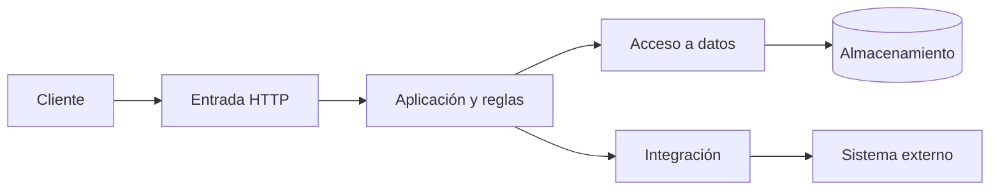

# Unidad 2 · Arquitectura por capas y patrones para APIs

**Fuente:** [Unidad 2 Arquitectura y Patrones (2).pdf](<../DOCS/Unidad 2 Arquitectura y Patrones (2).pdf>) · 20 páginas. Autora indicada: Ing. Patsy Malena Prieto MSc.

**Ruta de lectura:** arquitectura y capas, pp. 4-8; REST y ejemplo IoT, pp. 9-12; patrones, pp. 13-18. Este documento es diferente del PDF de 31 páginas de la misma unidad; ambos se resumen por separado.

## 1. Arquitectura: decisiones que condicionan los cambios

La arquitectura define cómo se distribuyen las responsabilidades y cómo colaboran los componentes. El material insiste en que las decisiones relevantes suelen ser difíciles de cambiar: quién posee datos, cómo se comunican los sistemas y dónde se controlan permisos o fallos.

**Acoplamiento** es el grado de dependencia entre componentes. Si la pantalla necesita conocer nombres de columnas o servidores internos, queda acoplada a detalles que cambian con facilidad. **Cohesión** describe cuánto se relacionan las responsabilidades dentro de un componente. Un servicio de facturación es más coherente cuando sus tareas pertenecen a ese dominio y no mezcla gestión de matrículas o notificaciones sin límites claros.

Un contrato de API ayuda a reducir dependencias, pero no elimina toda dependencia: el consumidor sigue necesitando comprender los significados y respetar los permisos.

## 2. Capas y recorrido de una solicitud

La p. 5 presenta cuatro responsabilidades:

| Capa | Función | Lo que conviene evitar |
|---|---|---|
| Presentación | Recibe interacción y presenta información. | Incluir reglas esenciales solo en la interfaz. |
| Aplicación | Coordina casos de uso y operaciones. | Mezclar transporte, persistencia y todas las reglas en una sola función. |
| Integración | Traduce entre contratos y conecta sistemas externos. | Hacer que el dominio dependa de cada formato de proveedor. |
| Acceso a datos | Lee y escribe almacenamiento. | Obligar al consumidor de la API a conocer consultas o tablas. |

**Elaboración didáctica:** al crear una matrícula, el controlador interpreta la petición, el servicio de aplicación comprueba el caso de uso, una integración consulta un sistema externo si hace falta y el repositorio guarda los datos. El resultado vuelve al cliente convertido en una representación estable.

Las capas son responsabilidades lógicas. No es obligatorio desplegarlas en servidores distintos. Tampoco toda petición debe recorrer una integración: si la operación no utiliza proveedores externos, esa tarea no existe en su flujo.

## 3. Estilos y tecnologías: distinguir dimensiones

Las pp. 6-8 enumeran monolito, SOA, REST, microservicios, eventos, gRPC y serverless. No son alternativas del mismo nivel. Monolito y microservicios se refieren a organización y despliegue; REST y gRPC, a estilos de interacción; eventos, a colaboración asíncrona; serverless, a un modelo de ejecución.

Un monolito modular puede exponer REST. Una arquitectura de microservicios puede usar REST para clientes, gRPC internamente y eventos para notificaciones. Una función serverless también puede responder a una petición HTTP.

**Monolito:** simplifica el despliegue inicial y las transacciones locales. Puede escalar replicando la aplicación completa, aunque no ofrece la misma independencia de escalado por componente.

**Microservicios:** distribuyen capacidades en servicios con límites y despliegues independientes. Su costo es gestionar red, observabilidad, disponibilidad y coordinación de datos. Independencia no significa que una cadena de llamadas deje de fallar cuando cae una dependencia.

**SOA:** organiza capacidades empresariales en servicios y promueve contratos e integración. No se distingue de microservicios únicamente por el tamaño de las clases.

**Eventos:** un productor publica un hecho para que otros componentes reaccionen. El consumidor puede procesarlo después, lo que exige controlar retrasos y duplicados.

### Aclaración de la p. 8

El bloque de gRPC repite una explicación del monolito y el de serverless describe características propias de BFF. Conviene estudiar esos conceptos con su significado específico: gRPC permite llamadas remotas mediante servicios y mensajes definidos; serverless ejecuta funciones administradas bajo demanda; BFF adapta capacidades para un frontend. La [introducción oficial de gRPC](https://grpc.io/docs/what-is-grpc/introduction/) confirma la definición mediante métodos, parámetros y retornos, con generación de clientes a partir del contrato.

## 4. REST: recursos, representaciones y restricciones

**REST** significa Representational State Transfer. Las pp. 10-11 explican cliente-servidor, ausencia de estado de sesión entre peticiones, caché, interfaz uniforme, sistema en capas y código bajo demanda opcional.

En una API HTTP orientada a recursos, `/usuarios/42` identifica un usuario y el método indica la intención. La representación puede ser JSON; JSON por sí solo no convierte una API en REST.

**Stateless** significa que cada solicitud debe contener el contexto necesario para procesarla. No significa que el servidor no guarde usuarios, pedidos o datos persistentes.

**Caché** permite reutilizar respuestas bajo reglas explícitas. `Cache-Control` comunica políticas y `ETag` identifica una versión de la representación. Si una consulta se repite y el contenido no cambió, puede evitarse retransmitirlo completo. La información privada necesita políticas apropiadas para impedir compartirla entre consumidores.

### Métodos del material, p. 12

| Método | Intención | Ejemplo didáctico |
|---|---|---|
| GET | Obtener una representación. | `GET /productos/17` |
| POST | Enviar datos para procesamiento, frecuentemente crear. | `POST /pedidos` |
| PUT | Establecer o reemplazar la representación del recurso indicado. | `PUT /direcciones/8` |
| PATCH | Aplicar una modificación parcial. | `PATCH /direcciones/8` |
| DELETE | Solicitar eliminación de la asociación del recurso con su URI. | `DELETE /direcciones/8` |

Una operación **idempotente** conserva el mismo efecto previsto al repetirla. Consultar o establecer el mismo valor puede ser idempotente; crear pedidos con `POST` no lo es automáticamente. Las respuestas pueden variar entre repeticiones sin que cambie esa propiedad.

## 5. Ejemplo IoT mostrado en la presentación

La p. 9 muestra dispositivos, un servidor web, la aplicación de API, almacenamiento y clientes. El esquema combina enrutamiento, balanceo, autenticación y limitación de tasa. Docker aparece como mecanismo de empaquetado y despliegue, no como reemplazo del contrato REST.

Su lectura paso a paso es: el dispositivo comunica datos; una entrada recibe el tráfico; la aplicación valida y procesa; el almacenamiento conserva el estado; otros clientes consultan representaciones. La API evita que cada cliente necesite conocer el dispositivo o la base de datos directamente. La guía sintetiza la figura del PDF, sin afirmar haber reproducido los resultados del artículo citado.

## 6. API Gateway

**Problema:** el cliente tendría que conocer varias ubicaciones y repetir controles comunes. **Funcionamiento:** una entrada estable recibe solicitudes y las dirige al backend adecuado. **Participantes:** consumidor, gateway y servicios destino.

El diagrama de la p. 14 muestra varios clientes conectados a una misma puerta de entrada y tres servicios detrás. En una matrícula, el gateway puede enrutar consultas académicas y operaciones financieras sin exponer sus servidores.

**Aplicación:** sistemas con múltiples servicios y políticas de entrada compartidas. **Consecuencias:** simplifica consumidores y centraliza controles, pero requiere disponibilidad y capacidad suficientes. Agregar lógica de todo el negocio al gateway crea un componente difícil de mantener.

## 7. Service Registry

**Problema:** las direcciones de las instancias cambian al escalar o reemplazar servicios. **Funcionamiento:** las instancias se registran en un catálogo y sus consumidores descubren ubicaciones utilizables. **Participantes:** instancias, registro y consumidor o gateway.

La p. 15 dibuja servicios que registran direcciones y un gateway que las consulta. El registro responde dónde encontrar una instancia; el balanceador decide cómo repartir llamadas. Son funciones relacionadas, pero diferentes.

**Aplicación:** infraestructura dinámica. **Consecuencias:** evita direcciones fijas en cada cliente, a cambio de mantener información de salud y tratar registros obsoletos. Un catálogo desactualizado puede dirigir tráfico a una instancia que ya no existe.

## 8. Backend for Frontend

**BFF** es un backend adaptado a las necesidades de una interfaz. **Problema:** web y móvil consumen datos diferentes. **Funcionamiento:** cada BFF compone y transforma respuestas para su consumidor. **Participantes:** frontend, BFF y servicios del dominio.

La p. 16 muestra variantes web, móvil y externa. Un móvil puede recibir cinco campos y una pantalla administrativa veinte, consultando capacidades comunes. Se reduce transferencia y esfuerzo del cliente, pero aumentan componentes de mantenimiento. La lógica empresarial compartida conviene mantenerla en servicios comunes, no duplicarla en cada BFF.

## 9. CQRS

**CQRS**, Command Query Responsibility Segregation, separa los modelos y responsabilidades de escritura y lectura. Un **comando** pide un cambio; una **consulta** obtiene información. El modelo de escritura protege reglas del negocio y el de lectura facilita respuestas adecuadas al consumidor.

Ejemplo didáctico: `ReservarCupo` valida disponibilidad; `ConsultarCursosDisponibles` devuelve una proyección optimizada para la pantalla. Una **proyección** es una representación derivada para consultar información.

La p. 17 presenta almacenamiento de eventos y otro de lectura. Es una variante posible, no una obligación de CQRS. Puede haber modelos distintos sobre la misma base; CQRS no exige Event Sourcing. La [documentación de CQRS de Microsoft](https://learn.microsoft.com/en-us/azure/architecture/patterns/cqrs) distingue modelos sobre un almacén compartido de modelos con almacenes separados. Las afirmaciones del PDF sobre velocidad universal de SQL y NoSQL no deben tomarse como regla: el resultado depende de consultas, índices y carga.

## 10. Circuit Breaker

**Problema:** una dependencia lenta acumula solicitudes y provoca fallos en cadena. **Funcionamiento:** el consumidor suspende temporalmente llamadas tras detectar un nivel de fallos. **Participantes:** consumidor, interruptor y dependencia.

La p. 18 distingue cerrado, abierto y semiabierto. Cerrado permite llamadas; abierto falla rápidamente; semiabierto deja pasar pruebas limitadas. Si las pruebas funcionan, vuelve a cerrado; si fallan, regresa a abierto.

Conviene usarlo al invocar dependencias susceptibles a fallos repetidos. Protege recursos, pero no repara el servicio ni garantiza que una respuesta alternativa sea válida. Un timeout limita una llamada; el circuit breaker controla llamadas sucesivas según lo observado.

## Síntesis y errores frecuentes

La arquitectura organiza responsabilidades y los patrones resuelven problemas concretos dentro de ella. Gateway organiza la entrada; Registry descubre instancias; BFF adapta al consumidor; CQRS separa modelos; Circuit Breaker contiene fallos. Un diseño no mejora por incluirlos todos, sino por relacionar cada uno con un problema demostrado.

## Preguntas de repaso

1. **¿Capas significa servidores separados?** No; pueden ser responsabilidades dentro de una aplicación.
2. **¿REST obliga a usar microservicios?** No; puede exponerse desde un monolito.
3. **¿Qué diferencia Gateway de Registry?** El primero recibe y enruta solicitudes; el segundo mantiene ubicaciones de instancias.
4. **¿BFF obliga a duplicar reglas del negocio?** No; adapta respuestas y utiliza capacidades comunes.
5. **¿CQRS necesita dos bases?** No; su núcleo es separar modelos y responsabilidades.
6. **¿Stateless prohíbe persistencia?** No; evita depender de contexto de sesión implícito entre peticiones.
7. **¿Circuit Breaker elimina los timeouts?** No; ambos limitan problemas diferentes y pueden complementarse.

[Volver al índice](README.md) · [Continuar con estilos y resiliencia](02-02-estilos-comunicacion-resiliencia.md)
