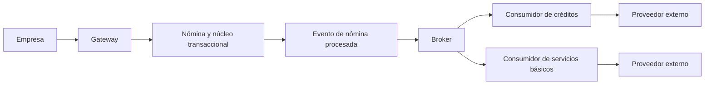

# Caso FinCorp · Nómina, débitos enlazados y consistencia eventual

**Fuente:** [FinCorp_Architectural_Strategy.pdf](<../DOCS/FinCorp_Architectural_Strategy.pdf>) · 3 páginas. Es un caso práctico complementario, sin numeración de clase visible.

**Ruta de lectura:** problema y requisitos, p. 1; arquitectura híbrida y patrones, p. 2; condición de carrera y alternativas abiertas, p. 3.

## 1. Idea central: separar procesos no permite ignorar sus reglas

FinCorp procesa una nómina masiva y después ejecuta cobros relacionados. El caso busca que un proveedor externo lento no bloquee el abono principal. La separación asíncrona mejora el aislamiento, pero crea un intervalo en el que el dinero ya figura depositado y todavía no se ejecutaron los débitos.

La pregunta de arquitectura es doble: cómo sostener disponibilidad y cómo preservar una regla sobre fondos comprometidos. Resolver solamente la comunicación no resuelve la regla del negocio.

Este resumen estudia el ejercicio de sistemas distribuidos. Los importes añadidos son ficticios y no establecen reglas bancarias o regulatorias reales.

## 2. Dimensión del problema

La p. 1 muestra 50.000 empleados, 50.000 débitos de crédito y 100.000 pagos de servicios. Después del abono inicial aparecen 150.000 operaciones derivadas.

Si todo se ejecuta en una única secuencia bloqueante, cualquier API externa lenta mantiene recursos ocupados y puede afectar consultas o transacciones que no dependen de ese proveedor. **Bloqueante** significa que el procesamiento no puede continuar hasta recibir cierto resultado.

Los requisitos del material priorizan fiabilidad, idempotencia y eficiencia. Expresiones como «cero fallos» o «idempotencia absoluta» expresan metas del caso; una arquitectura no demuestra esas garantías por nombrar patrones.

## 3. Transacción local y propiedades ACID

**ACID** agrupa atomicidad, consistencia, aislamiento y durabilidad. Atomicidad significa que los cambios de una transacción local se completan juntos o no se aplican. Consistencia significa preservar restricciones definidas; aislamiento controla interferencia de operaciones concurrentes; durabilidad conserva lo confirmado.

El dibujo de la p. 2 separa una zona síncrona del núcleo y una zona eventual para tareas derivadas. Su intención es que el depósito confirmado no se revierta por la caída de una empresa de servicios básicos.

La figura presenta el abono de la nómina como una operación ACID exitosa. Es un modelo conceptual: no especifica particiones, duración, transacciones por cuenta o estrategia real para ejecutar un lote de 50.000 empleados.

## 4. Arquitectura híbrida del PDF

El flujo pasa por cliente empresa, gateway, servicio de nómina y broker. Tras confirmar el abono se publica `PayrollProcessed`. Servicios de créditos y servicios básicos reaccionan y utilizan APIs externas.

El gateway organiza la entrada. El núcleo confirma cambios autoritativos. El broker desacopla etapas. Los consumidores gestionan operaciones externas. Sus fallos no deberían conservar bloqueada la transacción inicial.

## 5. Saga coreografiada

Una **saga** coordina una secuencia de transacciones locales. Si parte del proceso falla, puede ejecutar acciones compensatorias según la regla acordada. Una **compensación** corrige un efecto de negocio; no equivale al rollback técnico de una transacción única.

En **coreografía**, los participantes reaccionan a eventos y publican nuevos resultados. En **orquestación**, un coordinador dirige los pasos. El material selecciona coreografía para desacoplar las tareas derivadas y evitar una transacción distribuida bloqueante.

Sus participantes incluyen servicios de dominio, mensajes de progreso y acciones de recuperación. Los beneficios son autonomía y aislamiento temporal. Los costos son seguimiento del flujo, tiempos de convergencia y resolución de fallos parciales.

En este caso no se debe interpretar que una compensación externa puede eliminar automáticamente una nómina ya confirmada: la p. 1 pide preservar el abono. Cada efecto necesita su política explícita.

## 6. Idempotencia y reintentos

**Idempotencia** evita repetir el efecto previsto cuando se reenvía la misma operación. El PDF propone una clave UUID en la entrada. Un **UUID** es un identificador ampliamente usado para distinguir operaciones; generar uno no basta para impedir duplicados.

**Elaboración didáctica:** si una llamada de depósito pierde la respuesta, el cliente puede reenviarla con la misma clave. El servicio debe reconocer el intento y devolver el resultado existente sin volver a abonar.

La decisión y el efecto deben registrarse de manera duradera y coherente. Además, cada consumidor necesita deduplicar eventos: la protección del gateway no cubre automáticamente un débito repetido por un broker o por un reintento interno.

Una **dead letter queue**, cola de mensajes que no pudieron procesarse según la política, conserva fallos para análisis y recuperación. No equivale a que el cobro haya sucedido correctamente.

## 7. CQRS: consultas separadas de operaciones definitivas

CQRS separa modelos de lectura y escritura. La p. 2 dirige consultas masivas de saldo hacia representaciones optimizadas, actualizadas mediante eventos.

Esto reduce carga sobre el núcleo, pero una vista puede quedar atrasada. El saldo mostrado no debe ser la única autoridad al retirar fondos. El comando de retiro necesita verificar condiciones en el modelo que protege la cuenta.

**Error habitual:** pensar que CQRS elimina la condición de carrera. Puede mejorar lectura y escalado; la regla de fondos sigue necesitando protección en escritura.

## 8. Condición de carrera del material

Una **condición de carrera** aparece cuando el resultado depende del orden o momento de operaciones concurrentes. La p. 3 plantea:

| Momento | Hecho |
|---|---|
| T+0 s | Se acredita el sueldo y se publica el evento. |
| T+2 s | La aplicación muestra el saldo. |
| T+15 s | El empleado retira el efectivo disponible. |
| T+30 s | El consumidor de crédito intenta cobrar y encuentra fondos insuficientes. |

El mensaje puede llegar sin errores y aun así el proceso incumplir su intención. El problema es el intervalo entre acreditación y débito, no solamente la entrega de eventos.

## 9. Alternativas abiertas: qué resuelve cada una

La última página formula preguntas sobre reserva, compensación y outbox. No contiene una solución única final. Lo siguiente es **análisis didáctico complementario**.

### Reserva de fondos

Separar saldo total de saldo disponible permite retener una cantidad comprometida. Por ejemplo, sueldo ficticio de 1.000 y débito previsto de 200: el total puede ser 1.000 y el disponible 800 mientras se procesa el cobro.

El abono y la reserva deberían preservarse juntos bajo la regla local. El comando de retiro debe validar disponible en la fuente autoritativa. Cuando el débito termina, consume la reserva; cuando no corresponde, la libera bajo una política definida.

La reserva reduce la ventana de retiro del monto comprometido, pero requiere conocer cuánto retener y definir duración, fallos y liberación. Si una factura llega después con un importe desconocido, esa decisión no está resuelta solo por añadir el patrón.

### Compensación y bloqueo temporal

Una compensación intenta corregir efectos; un bloqueo temporal limita operaciones mientras se resuelve el proceso. Ambos necesitan analizar qué acciones son reversibles y qué impacto tiene impedir acceso a fondos.

Un bloqueo global por un proveedor externo lento contradice parte del objetivo de disponibilidad. Una retención limitada puede preservar una regla más específica, si está justificada por el dominio.

### Transactional Outbox

Una **outbox transaccional** guarda en la misma transacción local el cambio de negocio y un registro del evento a publicar. Un proceso posterior lo envía al broker y puede reintentar.

Resuelve el riesgo de confirmar un abono y perder su evento, o publicar un evento sin que el abono se haya confirmado. No impide por sí sola gastar fondos: ese efecto requiere una regla de reserva o disponibilidad. Tampoco garantiza entrega sin duplicados; los consumidores deben seguir siendo idempotentes.

## 10. Validación conceptual de una alternativa

Para defender una solución en clase, conviene recorrer al menos estos fallos: el broker está caído después del abono, el evento llega duplicado, el proveedor cobra pero se pierde su respuesta, el saldo de lectura está atrasado y un retiro coincide con el débito.

La alternativa debe explicar fuente de verdad, efectos ya confirmados, qué se reintenta y cómo se recupera. Este análisis no afirma que se ejecutaron pruebas del sistema; el PDF no aporta una implementación para validarlas.

## Síntesis

Saga coordina pasos, CQRS optimiza consultas, idempotencia evita efectos duplicados y outbox protege publicación coherente. La reserva protege la disponibilidad de fondos comprometidos. Cada uno aborda un riesgo diferente; combinarlos exige preservar las reglas del núcleo y diseñar recuperación.

## Preguntas de repaso

1. **¿Qué provoca la carrera?** Que el saldo esté disponible antes de que se ejecute el débito derivado.
2. **¿Una saga garantiza atomicidad global?** No; coordina transacciones locales y recuperación.
3. **¿La idempotencia del gateway cubre consumidores?** No; también necesitan protección de sus propios efectos.
4. **¿La outbox garantiza saldo suficiente?** No; garantiza coherencia entre cambio local y registro de publicación.
5. **¿Cuál es la autoridad del retiro?** El modelo transaccional que aplica las reglas de disponibilidad.
6. **¿Qué agrega una reserva?** Delimita fondos comprometidos antes del cobro asíncrono.
7. **¿Una compensación es un rollback?** No; es otra operación de negocio que corrige un efecto según sus reglas.

[Volver al índice](README.md) · [Continuar con VitalsGuard](06-caso-vitalsguard-iot-resiliencia.md)
