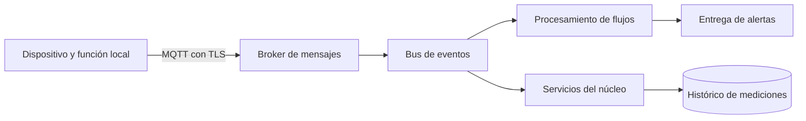

# Caso VitalsGuard · IoT, flujos de datos y contención de fallos

**Fuente:** [VitalsGuard_Critical_Architecture.pdf](<../DOCS/VitalsGuard_Critical_Architecture.pdf>) · 3 páginas. Es un caso complementario sin numeración de clase visible.

**Ruta de lectura:** requisitos, p. 1; topología híbrida, p. 2; fallo externo y opciones de evolución, p. 3.

## 1. Idea central: una dependencia externa no debe paralizar el núcleo

VitalsGuard representa un sistema IoT que recibe telemetría y genera alertas. El objetivo técnico es procesar flujos continuos y contener fallos de un proveedor de notificaciones. Si el envío de una notificación se bloquea, el procesamiento de nuevos datos debe conservar recursos para seguir trabajando.

El caso utiliza datos y umbrales de un contexto de salud. Se explican como elementos del ejercicio de arquitectura; no son criterios clínicos validados ni evidencia de que este diseño garantice seguridad de pacientes.

## 2. Requisitos del PDF y lo que falta precisar

La p. 1 describe transmisión de datos cada dos segundos, latencia máxima de alerta menor que un segundo, tolerancia a conectividad intermitente y protección de datos en tránsito.

**IoT**, Internet of Things, conecta dispositivos físicos que capturan información. **Edge** significa ejecutar parte del trabajo cerca del dispositivo, en lugar de depender siempre del servidor remoto.

El material propone alarmas locales de medicación para conservar una función durante pérdida de WiFi. La función local es una responsabilidad distinta de notificar remotamente a un familiar.

La latencia necesita un punto de inicio y uno de fin. Hay diferencia entre tiempo desde recibir una muestra hasta emitir una alerta y tiempo desde ocurrir un fenómeno hasta detectar y entregar esa alerta. Una muestra cada dos segundos no demuestra detección completa en menos de uno. Este límite se debe aclarar al evaluar el requisito.

## 3. Recorrido de la topología híbrida

La p. 2 combina dispositivo, broker, bus de eventos, procesamiento de flujos, microservicios, notificaciones y almacenamiento temporal.

El diagrama de esta guía resume responsabilidades. El PDF menciona EMQX/HiveMQ, Kafka, Flink e InfluxDB como componentes posibles; la presencia de sus nombres no aporta mediciones de una implementación real.

El dispositivo publica muestras. El broker recibe mensajes y ayuda a distribuirlos. El bus organiza flujos de eventos. El procesador evalúa condiciones. La salida intenta notificar y conserva el histórico según la ruta definida.

## 4. MQTT y TLS

**MQTT** utiliza publicación y suscripción sobre temas para intercambiar mensajes. Un **tema** identifica un canal lógico, como mediciones de un dispositivo. **TLS** protege la comunicación en tránsito y permite comprobar identidades bajo una configuración de confianza.

La figura selecciona MQTT para la ingesta y descarta REST por el costo del patrón repetitivo de solicitudes. Es una elección del caso, no una prohibición universal de HTTP para IoT: el efecto depende de frecuencia, conexiones y restricciones del dispositivo.

La aplicación todavía necesita controlar qué dispositivo publica en qué tema. Cifrar el transporte no autoriza automáticamente a todos los dispositivos a enviar información de cualquier identidad.

## 5. EDA y procesamiento de flujos

La arquitectura dirigida por eventos permite que varios consumidores procesen información sin depender de una única llamada síncrona. **Stream processing** ejecuta operaciones mientras los datos llegan, en lugar de esperar un lote completo.

**Elaboración didáctica:** cada muestra puede incluir identificador del dispositivo, instante de captura, secuencia y valores. El procesador puede detectar mensajes duplicados, determinar si llegaron tarde y aplicar una regla ilustrativa sobre una ventana de muestras.

Una **ventana** agrupa datos por tiempo o cantidad. Su tamaño afecta cuándo se puede tomar una decisión. Es necesario distinguir el tiempo del evento, cuando se capturó, del tiempo de procesamiento, cuando llegó al servidor.

Un bus no elimina sobrecarga permanente. Se necesitan límites, gestión del atraso y políticas para que un consumidor lento no impida trabajar a todos. **Backpressure** es un mecanismo de regulación cuando el receptor no puede absorber la tasa de entrada.

## 6. gRPC, CQRS y consultas históricas

El PDF plantea gRPC para comunicación interna con mensajes compactos y contratos definidos. Los tiempos de pocos milisegundos escritos en la figura son objetivos ilustrativos; no resultados medidos. La llamada remota sigue requiriendo plazo, cancelación y manejo de fallos.

El almacenamiento de series temporales organiza mediciones por tiempo. CQRS puede separar ingesta y comandos de consultas históricas, manteniendo modelos ajustados a cada necesidad.

La figura limita GraphQL a consultas históricas y lo considera inapropiado para escrituras masivas en este caso. La lección es separar consultas flexibles de una ruta crítica de ingesta. No significa que GraphQL sea incapaz de escribir datos o que siempre sea lento.

## 7. Fallo externo descrito en la última página

La p. 3 presenta un proveedor de notificaciones con caídas intermitentes y timeouts mayores de cinco segundos. Los hilos del núcleo quedan esperando respuestas y se amenaza el procesamiento de alertas.

El problema tiene una secuencia clara: la dependencia se ralentiza, crecen llamadas pendientes, se ocupan recursos compartidos y otros trabajos empiezan a esperar. Este es un **fallo en cascada**: una dependencia perjudica a componentes que podrían seguir operando.

El PDF formula una pregunta y ofrece Circuit Breaker, Bulkhead o Retry con backoff como opciones. No declara una solución final única. La siguiente combinación es **elaboración didáctica** para analizar responsabilidades.

## 8. Contención: qué aporta cada mecanismo

### Timeout y deadline

Un **timeout** limita una espera. Un **deadline** expresa el plazo máximo de una operación. La salida a notificaciones necesita un presupuesto compatible con su ruta; una espera externa de cinco segundos no puede entrar íntegra en una promesa de alerta menor de un segundo.

Cancelar una espera no siempre cancela el efecto remoto. Si se pierde una respuesta, el proveedor podría haber enviado la notificación; la recuperación debe considerar duplicados.

### Circuit Breaker

Se ubica alrededor de la invocación del proveedor de notificaciones. Observa fallos y latencia, permite llamadas en estado cerrado, falla rápidamente en abierto y prueba recuperación de manera limitada en semiabierto.

Su beneficio es dejar de insistir sobre una dependencia deteriorada. No garantiza que una alerta llegue. El sistema debe representar el estado pendiente o fallido y activar una recuperación definida.

### Bulkhead

Un **bulkhead**, aislamiento por compartimentos, separa recursos para que una tarea no consuma toda la capacidad compartida. Notificaciones puede utilizar un grupo de ejecución o límite de concurrencia independiente del procesador de muestras.

Esto permite que el núcleo continúe aunque se agoten los recursos de entrega externa. También necesita colas acotadas: cambiar un bloqueo de hilos por crecimiento ilimitado de memoria no contiene el problema.

### Retry con backoff y jitter

Los reintentos son apropiados para fallos seleccionados y con un número limitado. Backoff aumenta esperas y jitter evita sincronización. Su ejecución puede quedar en una ruta asíncrona de recuperación, con prioridad y plazo definidos.

Reintentar indefinidamente en el hilo que procesa muestras empeora el bloqueo. Una alerta antigua puede dejar de tener el mismo significado; su antigüedad debe formar parte de la decisión de entrega.

## 9. Ruta crítica y recuperación

Una interpretación didáctica consiste en separar evaluación de datos de entrega externa. El procesador genera una intención durable de notificación y sigue atendiendo muestras; un componente de entrega consume esas intenciones con límites y circuit breaker.

La notificación puede quedar pendiente, entregada o fallida. Esta separación conserva capacidad interna, pero también agrega atraso posible. Si el requisito exige entrega efectiva al destinatario dentro de un plazo, hacen falta mecanismos alternativos y comprobación de extremo a extremo; una cola no demuestra cumplimiento.

## 10. Telemetría para evaluar la solución

La p. 3 menciona OpenTelemetry. **Observabilidad** es la capacidad de inferir lo que ocurre a partir de señales del sistema. Una **métrica** resume cantidades, un **log** registra un hecho y una **traza** relaciona operaciones de un recorrido.

Para este caso sirven latencia desde recepción hasta decisión, tiempo hasta confirmación del proveedor, tasa de error, timeouts, concurrencia, profundidad y antigüedad de colas, lag de consumidores y transiciones del circuito.

**P95** es el valor bajo el cual cae el 95 % de las observaciones. Un promedio puede esconder una minoría de alertas muy lentas. Se deben medir resultados por etapa y también el recorrido completo.

Los umbrales de apertura y cierre deben basarse en requisitos y observación, no copiarse sin contexto de otra aplicación. Los registros y trazas también deben limitar datos sensibles.

## Síntesis

MQTT facilita ingesta, EDA desacopla etapas y el procesamiento de flujos evalúa datos continuamente. Timeout limita una espera, Circuit Breaker suspende llamadas problemáticas, Bulkhead protege recursos y Retry gestiona recuperación. La solución debe demostrar que contiene fallos y aclarar qué ocurre con una alerta cuando no puede entregarse.

## Preguntas de repaso

1. **¿Qué debe aclararse en la latencia de alerta?** Desde qué evento se mide y en qué confirmación termina.
2. **¿TLS concede acceso a cualquier tema?** No; también se necesitan identidad y permisos.
3. **¿Por qué un proveedor lento afecta al núcleo?** Porque puede agotar recursos compartidos esperando respuestas.
4. **¿Dónde se coloca el circuito?** En la invocación de la dependencia que se quiere contener.
5. **¿Qué agrega Bulkhead?** Aislamiento de capacidad para evitar agotamiento de todo el sistema.
6. **¿Retry siempre mejora fiabilidad?** No; sin límites puede multiplicar carga y retrasar el trabajo crítico.
7. **¿Encolar equivale a notificar?** No; recepción, procesamiento y entrega son etapas diferentes.
8. **¿Por qué observar percentiles?** Porque los promedios pueden ocultar las operaciones más lentas.

[Volver al índice](README.md)
