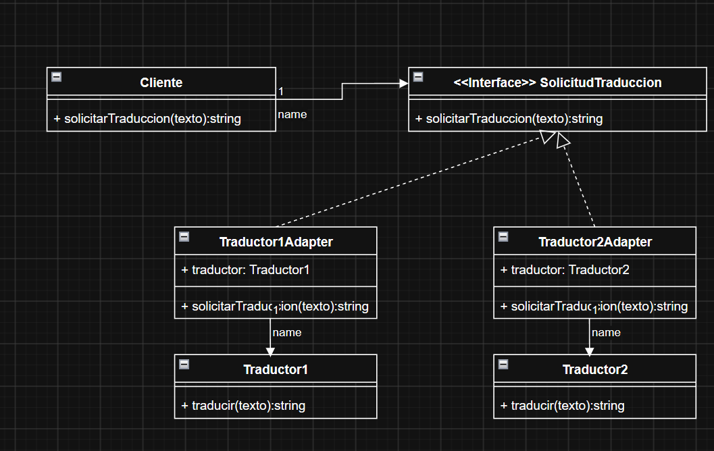

# Adapter · Caso 4: traducción externa

**El patrón está bien escogido y la estructura general es correcta.** `Cliente` depende de `SolicitudTraduccion`; los adaptadores implementan esa interfaz y delegan en sus respectivos proveedores.

Fuente: [Unidad_02_01_PDS.pdf](../../ClasesDiapositivas/Unidad_02_01_PDS.pdf), página 18, caso 4 de Adapter. El material plantea proveedores con interfaces distintas. Esta implementación conserva las firmas de tu dibujo, donde ambos proveedores ofrecen `traducir(texto)`; por eso demuestra una adaptación sencilla de nombres, no diferencias de parámetros o formatos entre proveedores.



## Cómo se traduce tu modelo a Java

| Papel | Clases |
|---|---|
| Contrato común (Target) | [SolicitudTraduccion](src/ejemplo/adapter/SolicitudTraduccion.java) |
| Cliente | [Cliente](src/ejemplo/adapter/Cliente.java) |
| Adaptadores | [Traductor1Adapter](src/ejemplo/adapter/Traductor1Adapter.java), [Traductor2Adapter](src/ejemplo/adapter/Traductor2Adapter.java) |
| Proveedores adaptados (Adaptee) | [Traductor1](src/ejemplo/adapter/Traductor1.java), [Traductor2](src/ejemplo/adapter/Traductor2.java) |
| Demostración | [Main](src/ejemplo/adapter/Main.java) |

```java
Cliente cliente = new Cliente(new Traductor1Adapter(new Traductor1()));
System.out.println(cliente.solicitarTraduccion("hola")); // hello
```

La llamada recorre `Cliente → SolicitudTraduccion → Traductor1Adapter → Traductor1.traducir(texto)`. Para utilizar el segundo proveedor se entrega al cliente un `Traductor2Adapter`; no se cambia la clase `Cliente`.

Los adaptadores reciben el proveedor por constructor, lo guardan en un atributo `private final` y reenvían el texto y la respuesta. No heredan del proveedor. Tampoco sustituyen un error por una traducción aparentemente exitosa.

**Alcance:** los proveedores son simulaciones locales, sin Internet ni claves. Traducen frases completas de español a inglés: `hola`, `buenos dias` y `gracias`. Aceptan mayúsculas y espacios en los extremos. Un texto vacío, nulo o fuera del diccionario produce un error explícito. No son traductores generales. No añadí idiomas a la firma para conservar tu contrato.

## Cómo ejecutarlo

Requiere JDK 11 o superior. Desde la raíz de MSNOTES, en PowerShell:

```powershell
& '.\PATRONES DE DISEÑO DE SOFTWARE\Ejercicios\Adapter-Caso04-Traduccion\verificar.ps1'
```

Compila sin dependencias externas, ejecuta el ejemplo y las pruebas. La demostración muestra `hello` para ambos proveedores. Tras compilar, puedes cambiar el texto:

```powershell
Set-Location 'PATRONES DE DISEÑO DE SOFTWARE/Ejercicios/Adapter-Caso04-Traduccion'
java -cp out ejemplo.adapter.Main "buenos dias"
```

**Verificación realizada:** compilación con `--release 11 -Xlint:all`, demostración y **5/5 pruebas aprobadas**. Las [pruebas](test/ejemplo/adapter/AdapterTest.java) comprueban ambos proveedores, independencia del cliente, delegación al proveedor correcto, propagación de errores y entradas inválidas. `out/` está excluido de Git.

## Revisión breve: qué corregir o mejorar en tu UML

| Punto | Recomendación |
|---|---|
| Referencias `+ traductor` públicas | Cambiarlas a privadas: `- traductor: Traductor1` y `- traductor: Traductor2`. El adaptador controla el acceso a su proveedor. |
| Firmas incompletas | Escribir `+ solicitarTraduccion(texto: String): String` y `+ traducir(texto: String): String`. Mantener exactamente el contrato común en los adaptadores. |
| Interfaces de proveedores idénticas | Es la principal simplificación respecto al caso. Para mostrar mejor el problema, un proveedor podría tener `traducir(texto)` y otro `translate(texto, idiomaDestino)`; su adaptador resolvería la diferencia. **No apliqué ese cambio a tu código:** conservé tus firmas. |
| Etiquetas `name` | Quitarlas o sustituirlas por nombres como `solicitud` y `traductor`. Son etiquetas de la herramienta, no responsabilidades del modelo. |

**Qué está bien:** la dirección Cliente → interfaz, la realización de la interfaz por los adaptadores y la referencia de cada adaptador a su proveedor. No necesitas cambiar de patrón ni rehacer toda la estructura.
