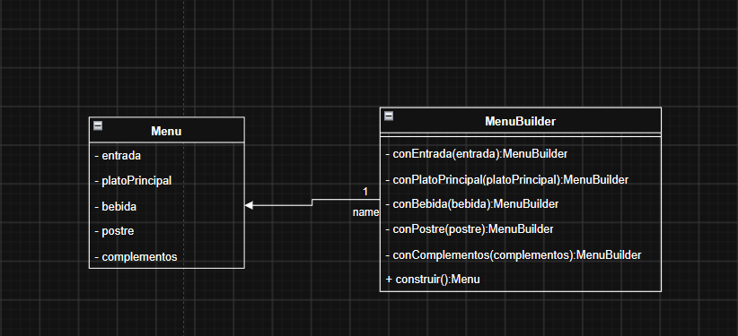
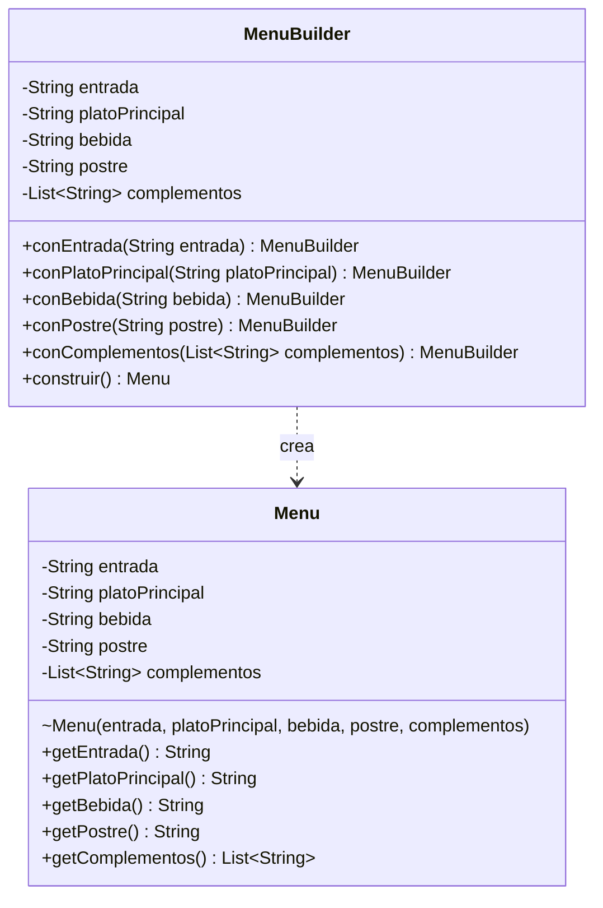

# Clase 03 · Caso 4 de Builder: menú de restaurante

Implementación Java de mi interpretación del UML del grupo. El diseño es adecuado para un **Builder moderno con métodos encadenados**: `Menu` representa el producto y `MenuBuilder` permite configurarlo progresivamente. El cliente decide qué pasos utiliza y finaliza con `construir()`.

Fuente del ejercicio: [Unidad_01_03_PDS.pdf](../../ClasesDiapositivas/Unidad_01_03_PDS.pdf), página 22, caso 4. La página 21 presenta la variante moderna sin Director; la página 18 presenta la estructura clásica. Este ejemplo es una interpretación didáctica, no una solución oficial del profesor.

## 1. Revisión del UML que elaboraron



**Lo que está bien:** separar la construcción del producto, identificar entrada, plato principal, bebida, postre y complementos, devolver `MenuBuilder` en los pasos y terminar con una operación que devuelve `Menu`. Esa estructura permite variar configuraciones sin crear un constructor largo para cada combinación.

| Elemento del UML | Evaluación y ajuste |
|---|---|
| Campos privados de `Menu` | Correcto. En Java se mantienen privados y se añaden `final` para proteger el producto terminado. |
| Métodos `- conEntrada(...)`, `- conBebida(...)`, etc. | Deben ser públicos (`+`) si el cliente los llama. Con `-` serían privados y el encadenamiento desde `Main` no sería posible. |
| Retorno `MenuBuilder` en cada paso | Correcto. Cada método devuelve `this`, la misma instancia de constructor. |
| `+ construir(): Menu` | Correcto. Crea el producto a partir de la configuración acumulada. |
| Atributos y parámetros sin tipo | Completar con `String` para las selecciones individuales y `List<String>` para complementos. Son tipos elegidos para este ejemplo, no definidos en el enunciado. |
| Relación hacia `Menu` con multiplicidad `1` | Tiene sentido si el Builder conserva un único menú en preparación. En esta implementación conserva los valores y crea un menú nuevo al final; corresponde una dependencia de creación. |
| Etiqueta `name` junto a la relación | No comunica una responsabilidad clara. Si mantienen una asociación, usar un rol como `menuEnConstruccion`; para la dependencia propuesta, usar `«create»`. |
| Ausencia de Director | Es coherente con la variante moderna de la página 21. No hace falta añadirlo solo para completar el dibujo clásico. |

La mejora principal es hacer explícito el contrato: quién puede llamar a cada método, qué datos recibe y qué entrega. No es necesario cambiar de patrón.

## 2. Interpretación y reglas elegidas

El enunciado dice que algunas partes pueden ser opcionales, pero **no identifica cuáles son obligatorias**. Para no atribuir al profesor una regla que no está definida, esta versión permite omitir cualquier parte, incluso construir un menú vacío. Esto es una decisión provisional del ejemplo, no una recomendación de negocio para un restaurante.

- Una selección individual omitida se representa con `null`. Los getters lo documentan y `Main` muestra `sin seleccionar`.
- Los complementos omitidos se representan con una lista vacía, nunca con `null`.
- Si se invoca un método `con...`, el texto debe ser no nulo y no estar en blanco. Omitir un paso es distinto de pasarle un dato inválido. Los textos válidos se conservan tal como se reciben.
- `conComplementos(...)` recibe una lista de textos válidos y **reemplaza** la selección anterior. La lista vacía permite quitar todos los complementos; se conservan orden y duplicados porque el caso no los restringe.
- Repetir un paso individual reemplaza su valor: la última bebida seleccionada es la que se construye.
- `construir()` crea un objeto nuevo y no reinicia el Builder. Los valores seleccionados permanecen disponibles para otra construcción.
- Cambiar el Builder después no altera un menú anterior. Para comenzar una configuración desde cero, se crea otro `MenuBuilder`.

Estas validaciones son decisiones técnicas añadidas para que el ejemplo tenga un comportamiento claro. No hay reglas sobre precios, cantidades, alérgenos, combinaciones permitidas ni tipos de dieta.

## 3. Cómo se distribuye el código

| Archivo | Responsabilidad |
|---|---|
| [Menu.java](src/ejemplo/builder/Menu.java) | Producto final con cinco atributos, getters y copia no modificable de complementos. |
| [MenuBuilder.java](src/ejemplo/builder/MenuBuilder.java) | Acumula la configuración, valida selecciones y construye una nueva instancia. |
| [Main.java](src/ejemplo/builder/Main.java) | Cliente ejecutable con menú completo, ligero y dos variantes a partir del mismo Builder. |
| [MenuBuilderTest.java](test/ejemplo/builder/MenuBuilderTest.java) | Ocho escenarios de prueba sin bibliotecas externas. |

`Menu` es inmutable: sus campos son privados y finales, no tiene setters y su lista no puede modificarse. Los textos también son inmutables. La copia de la lista evita que una referencia externa cambie la configuración o el producto.

El constructor de `Menu` tiene acceso de paquete, representado en UML con `~`. Las clases del mismo paquete pueden invocarlo; no se afirma que Java obligue a pasar exclusivamente por el Builder. Desde otros paquetes se utiliza la API pública de `MenuBuilder`. Si se quisiera un constructor privado, una alternativa sería un Builder anidado, pero cambiaría la organización de dos clases separadas del grupo.

`MenuBuilder` sí es mutable: va recibiendo selecciones. No debe compartirse entre hilos. No se necesita una interfaz de Builder ni subclases para las configuraciones mostradas, porque todas producen el mismo tipo de producto mediante los mismos pasos.

## 4. Ejemplo de uso y recorrido

```java
Menu menu = new MenuBuilder()
        .conEntrada("Sopa de verduras")
        .conPlatoPrincipal("Pollo con arroz")
        .conBebida("Jugo de naranja")
        .conPostre("Flan")
        .conComplementos(List.of("Ensalada", "Pan"))
        .construir();
```

El fragmento usa las clases del paquete `ejemplo.builder` y `java.util.List`; el archivo `Main.java` contiene el ejemplo completo.

1. `new MenuBuilder()` inicia una configuración sin selecciones.
2. `conEntrada(...)` guarda el valor y devuelve `this`.
3. La siguiente llamada opera sobre ese mismo Builder. El orden de estos pasos no es obligatorio en esta versión.
4. `construir()` toma los valores actuales y crea un `Menu` nuevo.
5. El cliente consulta el producto mediante getters; ya no necesita modificarlo.

Un menú ligero solo utiliza plato principal y bebida. No necesita pasar valores nulos para las partes omitidas ni elegir entre muchas sobrecargas de constructor.

La reutilización también es explícita:

```java
MenuBuilder base = new MenuBuilder().conPlatoPrincipal("Pasta");
Menu primero = base.construir();
Menu segundo = base.conPostre("Fruta").construir();
// primero.getPostre() sigue siendo null; segundo tiene "Fruta".
```

## 5. UML ajustado a esta implementación

El diagrama siguiente mantiene las dos clases principales y muestra sus miembros públicos relevantes. Los campos del Builder representan el estado en preparación; `Menu` se crea al finalizar. Se omite únicamente el helper privado de validación y las clases cliente/pruebas.



La dependencia discontinua no lleva multiplicidad `1`: un Builder puede crear varios productos a lo largo de su uso, sin mantenerlos como atributos. La inmutabilidad de los campos de `Menu` se expresa con `final` en el código.

## 6. Cómo compilar, ejecutar y probar en PowerShell

Requisito: **JDK 11 o superior**, con `java` y `javac` disponibles. No se necesita Maven, Gradle, conexión a Internet ni dependencias externas.

Desde la raíz de MSNOTES:

```powershell
Set-Location 'PATRONES DE DISEÑO DE SOFTWARE/Ejercicios/Clase03-Builder-Menu'
[Console]::OutputEncoding = [System.Text.UTF8Encoding]::new($false)
$fuentesMenu = @(Get-ChildItem -Path src,test -Filter *.java -Recurse | ForEach-Object { $_.FullName })
javac -encoding UTF-8 --release 11 -Xlint:all -d out $fuentesMenu
if ($LASTEXITCODE -ne 0) { throw 'Falló la compilación' }
java '-Dfile.encoding=UTF-8' -cp out ejemplo.builder.Main
if ($LASTEXITCODE -ne 0) { throw 'Falló la demostración' }
java '-Dfile.encoding=UTF-8' -cp out ejemplo.builder.MenuBuilderTest
if ($LASTEXITCODE -ne 0) { throw 'Fallaron las pruebas' }
```

Las comillas del argumento `'-Dfile.encoding=UTF-8'` evitan que PowerShell lo interprete incorrectamente. Los archivos compilados se escriben en `out/`, excluido mediante el `.gitignore` de este ejercicio.

La demostración imprime cuatro menús. Entre los resultados esperados están:

```text
=== Menú ligero ===
Entrada: sin seleccionar
Plato principal: Ensalada de garbanzos
Bebida: Agua
Postre: sin seleccionar
Complementos: []
```

La configuración base conserva `Postre: sin seleccionar`, mientras la construcción posterior muestra `Postre: Fruta`. Las pruebas terminan con:

```text
Resultado: 8/8 pruebas aprobadas.
```

**Validación realizada:** compilación sin advertencias con OpenJDK 21.0.2, usando `--release 11`; ejecución de `Main` y de los ocho escenarios el 12 de septiembre de 2026. Se comprobó compatibilidad de compilación para Java 11, pero no se ejecutó en una JVM 11 independiente. Las pruebas usan comprobaciones explícitas y fallan con código de salida no cero; no requieren activar `-ea`.

Los escenarios verifican campos completos, partes omitidas, instancias independientes, copia de listas, lista no modificable, reemplazo de selecciones, rechazo de textos inválidos y rechazo de listas inválidas sin dejar cambios parciales.

## 7. Recomendaciones para mejorar el UML del grupo

El diagrama identifica correctamente el producto `Menu`, su constructor `MenuBuilder` y la operación final `construir(): Menu`. Para que comunique con precisión el diseño, recomiendo los siguientes ajustes sobre el UML presentado:

| Aspecto del UML original | Ajuste recomendado en el diagrama | Justificación |
|---|---|---|
| Los métodos `con...` aparecen con `-` | Cambiar a `+ conEntrada(entrada: String): MenuBuilder` y aplicar la misma visibilidad a los demás pasos. | El cliente necesita invocarlos; el signo `-` los declara privados. |
| Los atributos de `Menu` no tienen tipo | Escribir `- entrada: String`, `- platoPrincipal: String`, `- bebida: String`, `- postre: String` y `- complementos: List<String>`. | Permite distinguir una selección individual de una colección y elimina ambigüedades al implementar. |
| Los parámetros de los pasos no tienen tipo | Completar cada firma, por ejemplo `+ conBebida(bebida: String): MenuBuilder` y `+ conComplementos(complementos: List<String>): MenuBuilder`. | Explicita qué recibe cada operación y conserva el retorno necesario para encadenar llamadas. |
| No se muestra dónde guarda el Builder la configuración | Para representar el código de este ejemplo, añadir a `MenuBuilder` los cinco atributos privados con sus tipos. | Hace visible el estado que acumulan los pasos antes de construir el producto. |
| Hay una asociación hacia `Menu` con multiplicidad `1` | Para esta implementación, sustituirla por una dependencia discontinua `MenuBuilder ..> Menu`, etiquetada `«create»`, sin multiplicidad. | El Builder crea productos nuevos, pero no conserva un `Menu` como atributo. La asociación original sería válida con otra estrategia que mantuviera un menú en preparación. |
| La relación tiene la etiqueta genérica `name` | Eliminarla al usar la dependencia de creación. Si conservan la estrategia de asociación, nombrar el rol `menuEnConstruccion`. | El nombre debe explicar el propósito de la relación. |
| `Menu` muestra únicamente atributos privados | Añadir sus operaciones públicas de consulta, como `+ getEntrada(): String` y `+ getComplementos(): List<String>`. | Explica cómo utiliza el cliente el producto terminado sin acceder directamente a sus atributos. |
| No se expresa cómo se protege el producto terminado | Añadir una nota UML: «Menu es inmutable; sus selecciones y complementos no cambian después de construirlo». | Hace explícita una decisión adoptada en el código, que no se deduce únicamente del signo `-`. |
| No se describen las condiciones de construcción | Añadir una nota junto a `construir()`: «Crea un Menu nuevo y conserva la configuración del Builder; las partes omitidas permanecen sin seleccionar». | Aclara el comportamiento de esta versión. El enunciado no permite deducir qué partes son obligatorias. |

**Qué conservar:** las dos clases separadas, los nombres de los pasos, su retorno `MenuBuilder` y `+ construir(): Menu`. Identificar el dibujo con una nota «Builder moderno sin Director» permite relacionarlo con la variante de la página 21 de la clase; la ausencia de Director no es un error en esa variante.

Con estos ajustes, el UML permite responder quién configura el menú, dónde se guardan las selecciones, cuándo se crea el producto y cómo lo consulta el cliente. El diagrama de la sección 5 muestra la estructura correspondiente al código de este ejemplo.
