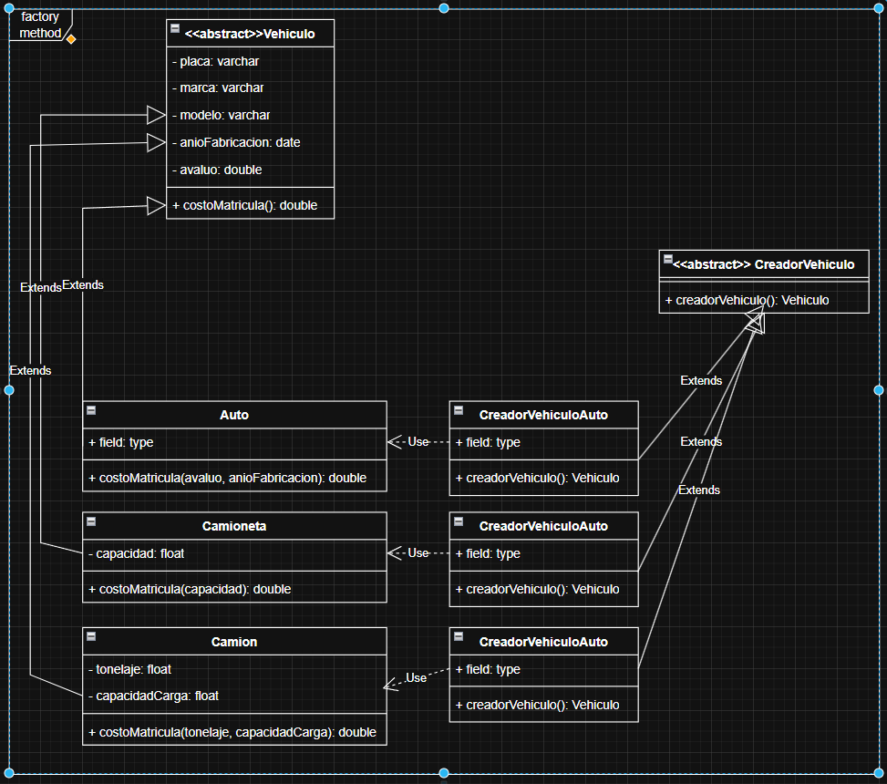
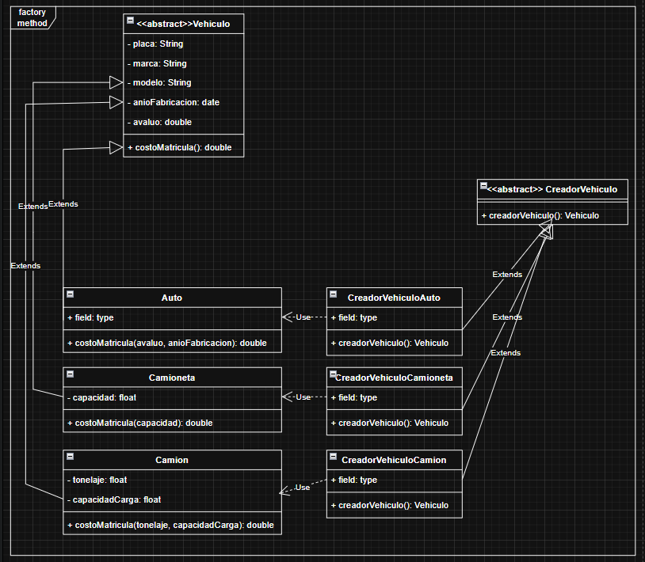
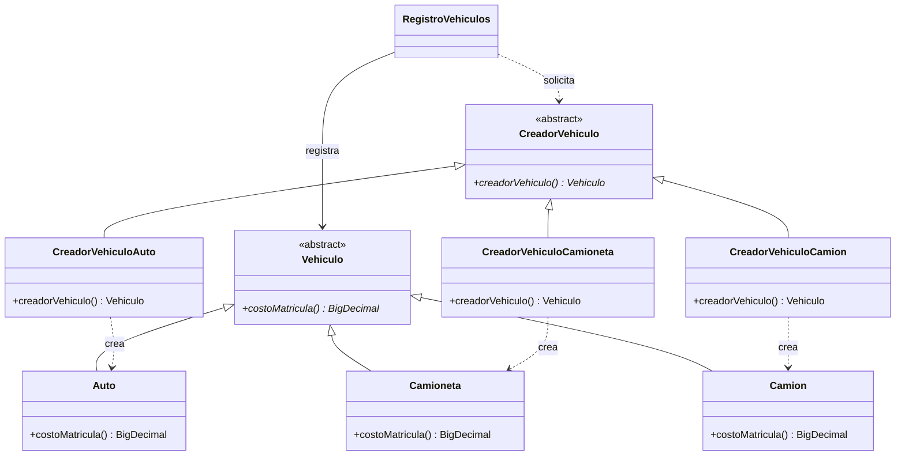

# Escenario 01: registro de vehículos con Factory Method

La elección de **Factory Method es correcta**: el creador abstracto define una operación que devuelve `Vehiculo` y cada creador concreto decide qué clase instanciar. Auto, Camioneta y Camión comparten datos y el contrato `costoMatricula()`, pero cada uno implementa su cálculo.

Esta solución parte del escenario y de los UML V1 y V2 del grupo. Aplica las decisiones confirmadas durante la revisión; las fórmulas son ejemplos académicos delegados al implementador. No representan tarifas reales de matriculación.

## 1. Comparación de las capturas V1 y V2

| V1: modelo inicial | V2: revisión enviada por el grupo |
|---|---|
|  |  |

Las imágenes se conservan tal como fueron recibidas. La siguiente tabla distingue cambios observados de decisiones aplicadas solo al código:

| Aspecto | V1 | V2 | Tratamiento en Java |
|---|---|---|---|
| Patrón y jerarquías | Factory Method con productos y creadores | Se conserva | Se conserva; no se sustituye por una fábrica central con `switch`. |
| Nombres de creadores | Tres clases llamadas `CreadorVehiculoAuto` | Auto, Camioneta y Camión tienen creadores diferenciados | Se utilizan los nombres corregidos. |
| Placa, marca y modelo | `varchar` | `String` | `String`, como se aceptó. |
| Firma de cálculo | Base sin parámetros; subclases con parámetros | Sigue igual en la captura | Todas implementan `costoMatricula()` sin parámetros. La corrección fue aceptada, aunque aún no está dibujada. |
| Año e importes | `date` y `double` | Permanecen | Año como `int`; avalúo y resultado como `BigDecimal`. |
| `field: type` | Campos provisionales visibles | Continúan visibles | Se omiten: el grupo aclaró que son restos de la herramienta. |
| Dependencias concretas | Flechas discontinuas con `Use` | Se conservan | Cada creador instancia su producto; `«create»` expresa mejor esa intención. |
| Entrada de datos | No se muestran constructores de los creadores | Tampoco se muestran | Decisión confirmada: recibir datos al inicializar el creador y mantener `creadorVehiculo()` sin parámetros. |
| Cliente y selección | No aparecen | No aparecen | Se incluyen en la demostración; su omisión en el diagrama resumido no invalida el patrón. |
| Unidades y fórmulas | No especificadas | No especificadas | Se concretan como supuestos didácticos autorizados. |

La V2 mejora nombres y tipos de texto. El pendiente conceptual más importante del dibujo es uniformar la firma de cálculo para expresar correctamente el polimorfismo.

## 2. Cómo funciona la implementación

| Participante | Archivo y responsabilidad |
|---|---|
| Producto abstracto | [Vehiculo.java](src/ejemplo/vehiculos/Vehiculo.java): datos comunes y `costoMatricula(): BigDecimal`. |
| Productos concretos | [Auto.java](src/ejemplo/vehiculos/Auto.java), [Camioneta.java](src/ejemplo/vehiculos/Camioneta.java) y [Camion.java](src/ejemplo/vehiculos/Camion.java): implementan sus cálculos. |
| Creador abstracto | [CreadorVehiculo.java](src/ejemplo/vehiculos/CreadorVehiculo.java): guarda los datos comunes y declara el Factory Method. |
| Creadores concretos | [CreadorVehiculoAuto.java](src/ejemplo/vehiculos/CreadorVehiculoAuto.java), [CreadorVehiculoCamioneta.java](src/ejemplo/vehiculos/CreadorVehiculoCamioneta.java) y [CreadorVehiculoCamion.java](src/ejemplo/vehiculos/CreadorVehiculoCamion.java): construyen el tipo correspondiente. |
| Cliente del patrón | [RegistroVehiculos.java](src/ejemplo/vehiculos/RegistroVehiculos.java): registra el producto recibido del creador sin conocer clases concretas. |
| Entrada de la aplicación | [Main.java](src/ejemplo/vehiculos/Main.java): interpreta argumentos y selecciona el creador mediante un registro de funciones. |

Se conserva el nombre `creadorVehiculo()` que utiliza el UML. Es un método, no un constructor Java: el constructor tiene el mismo nombre de la clase y no declara retorno.

```java
CreadorVehiculo creador = new CreadorVehiculoAuto(
        "ABC-123", "Marca", "Modelo", 2020,
        new BigDecimal("20000"), 2026);
Vehiculo vehiculo = creador.creadorVehiculo();
BigDecimal costo = vehiculo.costoMatricula();
```

Primero, el cliente entrega datos al constructor del creador. Después, `creadorVehiculo()` los entrega al constructor del producto. Finalmente, `costoMatricula()` usa el estado almacenado en el propio vehículo: sus atributos y los getters de los datos comunes privados. `this` siempre se refiere al objeto sobre el que se está ejecutando el método. En este escenario no interviene un Builder.

Cada invocación del Factory Method crea un producto nuevo. La validación de los datos se realiza al construir el vehículo; un fallo evita incorporarlo al registro. Los vehículos son inmutables y la consulta del registro devuelve una lista no modificable. El registro es únicamente en memoria, sin persistencia ni regla de unicidad de placa inventada.

Para añadir otro tipo se implementan su producto y creador y se registra su opción en la configuración de entrada. Esa modificación localizada es distinta de modificar `RegistroVehiculos` o el flujo que calcula mediante `Vehiculo`. Una prueba incorpora un tipo adicional sin modificar ese cliente.

## 3. Cálculos y supuestos del ejemplo

Se recibe `anioCalculo` explícitamente para que la antigüedad y las pruebas no cambien según el día de ejecución. Es un dato técnico añadido al código; no estaba en las capturas. `A` representa avalúo y `edad = anioCalculo - anioFabricacion`.

| Tipo | Fórmula ficticia | Ejemplo con año de cálculo 2026 |
|---|---|---|
| Auto | `A × 0.01 × max(0.50, 1 - 0.05 × edad)` | A = 20.000, fabricación 2020: resultado **140,00**. |
| Camioneta | `A × 0.012 + capacidad × 0.02` | A = 30.000, capacidad de carga = 800 kg: **376,00**. |
| Camión | `A × 0.015 + tonelaje × 10 + capacidadCarga × 5` | A = 50.000, tonelaje = 12 t, capacidad de carga = 8 t: **910,00**. |

En Camioneta se interpreta `capacidad` como kilogramos de carga. En Camión se conservan los dos datos del UML y ambos se expresan en toneladas: el tonelaje es una medida total de referencia y la capacidad indica la carga. El ejercicio no añade una regla de relación entre ambas medidas.

Los importes se calculan con `BigDecimal` y se redondean una sola vez al final a dos decimales con `HALF_UP`. Las medidas físicas usan `double` y se convierten con `BigDecimal.valueOf` al intervenir en la fórmula. Se rechazan medidas no positivas, infinitas o `NaN`; los textos deben estar informados, el avalúo ser no negativo y el año de fabricación estar entre 1 y el año de cálculo. Son supuestos de validación del ejemplo, no normas oficiales del dominio.

## 4. Estructura ajustada de la implementación

Este esquema es una propuesta derivada del código, **no una modificación de la captura V2**. Omite atributos y constructores para destacar las relaciones:



El cliente se muestra aquí para explicar la colaboración, pero puede mantenerse fuera del UML resumido del grupo.

## 5. Ejecución y evidencia de pruebas

Requiere JDK 11 o superior en `PATH`. Desde la raíz de MSNOTES, ejecutar en PowerShell:

```powershell
& '.\PATRONES DE DISEÑO DE SOFTWARE\Ejercicios\Escenario01-FactoryMethod-Vehiculos\verificar.ps1'
```

El script compila con `javac -encoding UTF-8 --release 11 -Xlint:all`, ejecuta los tres ejemplos y las pruebas. No utiliza Maven ni dependencias externas. Después de compilar, también se pueden proporcionar datos propios:

```powershell
Set-Location 'PATRONES DE DISEÑO DE SOFTWARE/Ejercicios/Escenario01-FactoryMethod-Vehiculos'
java -cp out ejemplo.vehiculos.Main auto ABC-123 Marca Modelo 2020 20000 2026
java -cp out ejemplo.vehiculos.Main camioneta DEF-456 Marca Modelo 2021 30000 2026 800
java -cp out ejemplo.vehiculos.Main camion GHI-789 Marca Modelo 2018 50000 2026 12 8
```

Los argumentos son tipo, placa, marca, modelo, año de fabricación, avalúo, año de cálculo y las medidas específicas. Los decimales se escriben con punto; los textos con espacios se pasan entre comillas. Una entrada inválida muestra un mensaje y finaliza con código 2.

**Validación ejecutada el 16 de septiembre de 2026:** compilación sin advertencias con OpenJDK 21.0.2 y destino Java 11; ejemplos con resultados 140.00, 376.00 y 910.00; **10/10 pruebas aprobadas**. No se ejecutó una JVM 11 independiente. Los `.class` quedan en `out/`, excluido de Git.

Las [pruebas](test/ejemplo/vehiculos/VehiculosTest.java) cubren selección de productos, cálculo polimórfico, antigüedad y redondeo, instancias independientes, registro, extensión con un nuevo tipo, datos inválidos y errores de entrada.

## 6. Decisiones y prompt final

El [registro de decisiones](DECISIONES.md) documenta las propuestas, las respuestas del grupo y su justificación técnica. El [prompt final del escenario](PROMPT-FINAL.md) reúne las decisiones ya cerradas en un mensaje reutilizable.

## 7. Revisión final del UML: recomendaciones sobre V2

1. **Actualizar las firmas de las tres subclases a `+ costoMatricula(): BigDecimal`.** Se aceptó eliminar los parámetros, pero V2 todavía los muestra. Esta es la corrección necesaria para representar el contrato común.
2. **Mantener los nombres diferenciados de los creadores y los atributos `String`.** Son mejoras que ya se observan entre V1 y V2.
3. **Representar la entrega de datos al constructor de cada creador**, o explicarla con una nota. Mantener `+ creadorVehiculo(): Vehiculo` sin parámetros, como se acordó.
4. **Si el diagrama se presenta como traducción exacta de este Java**, actualizar año a `int`, importes a `BigDecimal` e incluir el año de cálculo. Si es un esquema conceptual, basta con documentar esa adaptación técnica.
5. **Retirar `field: type` y preferir `«create»` en las dependencias de creación.** Es limpieza del dibujo; no supone cambiar la solución.
6. **Conservar las jerarquías existentes.** No hace falta cambiar de patrón ni añadir obligatoriamente el cliente al dibujo. Las fórmulas y unidades pueden permanecer en las notas de implementación por decisión del grupo.
