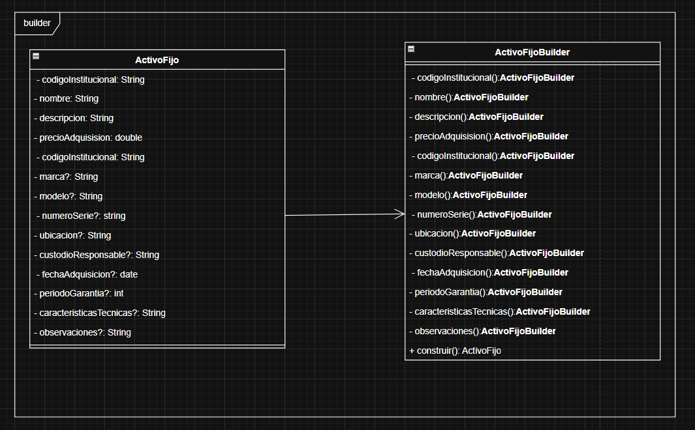
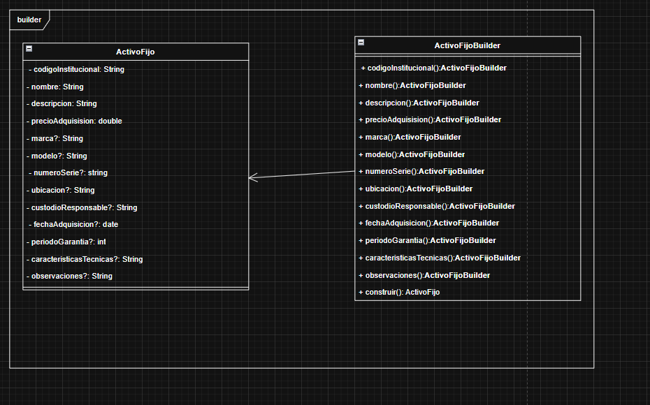
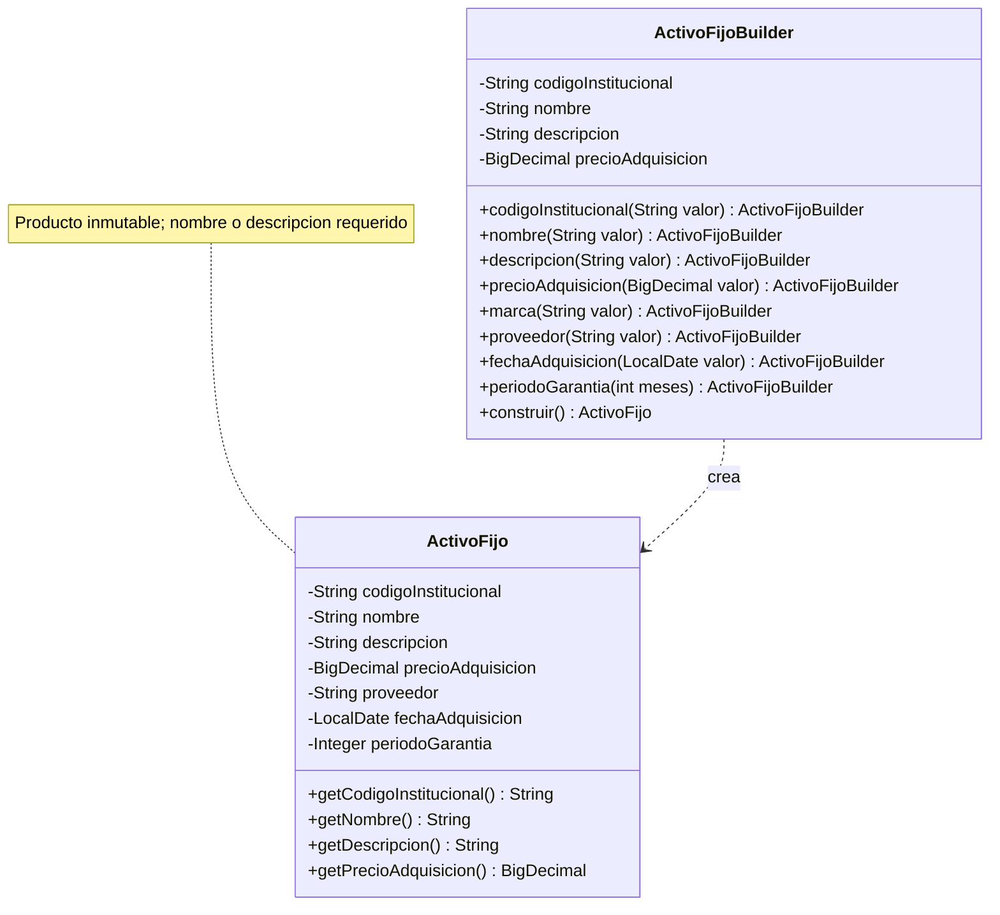

# Escenario 02: activos fijos con Builder

La elección de **Builder moderno es correcta**: permite incorporar de forma legible los datos de un activo sin obligar al cliente a usar un constructor con numerosas combinaciones de parámetros. Se conservan dos clases, `ActivoFijo` y `ActivoFijoBuilder`, y no se añade un Director innecesario para este caso.

El producto terminado es inmutable. El Builder mantiene el estado de construcción y cada método público devuelve `this`. Se conservan `nombre` y `descripcion` como campos separados, según la elección del grupo.

## 1. Comparación de las capturas V1 y V2

| V1: modelo inicial | V2: revisión enviada por el grupo |
|---|---|
|  |  |

Las imágenes originales no fueron editadas. La comparación distingue cambios reales del dibujo y decisiones posteriores de implementación:

| Aspecto | V1 | V2 | Tratamiento en Java |
|---|---|---|---|
| Patrón | Builder con producto y constructor separado | Se conserva | Se conserva la variante moderna, sin Director. |
| Visibilidad de pasos | Métodos de configuración privados (`-`) | Públicos (`+`) | Públicos y encadenables. Corrección visible y aceptada. |
| Código institucional | Duplicado en ambas clases | Una sola aparición por clase | Un atributo y un método de configuración. |
| Dirección de la flecha | `ActivoFijo` apunta al Builder | Builder apunta al producto | Se utiliza una dependencia de creación; no se guarda un producto mutable dentro del Builder. |
| Parámetros de los pasos | No aparecen | Siguen sin aparecer | Cada método recibe el dato que configura, por ejemplo `marca(String valor)`. |
| Nombre y descripción | Dos campos | Se mantienen dos campos | Se conserva la elección; al menos uno debe estar informado. |
| Proveedor | Omitido | Sigue omitido | Se incluye un texto opcional por estar presente en el escenario; no se crea otra entidad. |
| Opcionalidad | `?` en nombres | Se conserva | Se respeta la intención. La notación UML formal queda como observación, no como obligación de rehacer la captura. |
| Tipos y garantía | Mezcla `String`, `string`, `date`, `double`; garantía sin unidad | Continúa | Tipos Java y meses se resuelven en código, como se delegó. |
| Estado del Builder e inmutabilidad | No se detallan | No se detallan | El Builder conserva los valores y el producto tiene campos privados finales sin setters. Decisión aceptada. |

La V2 corrige la visibilidad, la duplicación y la orientación de la relación. Mantiene detalles abreviados que la implementación completa sin cambiar el patrón.

## 2. Contrato y decisiones de implementación

Para construir un activo se necesitan **código institucional, precio de adquisición y al menos uno entre nombre o descripción**. Se permite informar ambos. La elección de dos campos no se interpreta como una exigencia de completar los dos, porque el enunciado dice «nombre o descripción».

Se conservan los métodos del modelo para configurar todos los datos. No se sustituye esa API por un constructor obligatorio de tres argumentos: los campos requeridos se establecen con pasos legibles y `construir()` impide entregar un producto incompleto. En los ejemplos se configuran primero los obligatorios y luego los opcionales; no se impone un orden de llamadas mediante tipos adicionales.

| Dato | Tipo y tratamiento |
|---|---|
| Código, nombre, descripción y demás textos | `String`; si se invoca el paso, el texto debe estar informado y no estar en blanco. |
| Precio | `BigDecimal` obligatorio y no negativo; cero es un valor explícito permitido por esta implementación. No se inventa la regla «debe ser mayor que cero». |
| Fecha de adquisición | `LocalDate` opcional; no se prohíben fechas futuras porque el escenario no define esa regla. |
| Período de garantía | Meses, mediante `Integer` en el producto: `null` significa desconocido; `0` significa cero meses informados. |
| Características técnicas | Texto libre, como en el UML; permite describir procesador, material o dimensiones sin inventar nuevas jerarquías. |
| Proveedor | Texto opcional, al mismo nivel que marca o ubicación. |

Para omitir un campo opcional no se llama al método correspondiente. No se obliga a pasar `null` o cadenas vacías. Los getters de campos omitidos devuelven `null`, y el ejemplo muestra «no informado». Una llamada que proporciona un valor inválido lanza `IllegalArgumentException`; la ausencia de un obligatorio al finalizar lanza `IllegalStateException`.

Repetir un paso reemplaza el valor anterior. `construir()` produce una nueva instancia y conserva la configuración del Builder. Cambiar después el Builder no modifica los activos anteriores. Para empezar desde cero se crea otro Builder; no se comparte entre hilos.

## 3. Código y ejemplos

| Archivo | Responsabilidad |
|---|---|
| [ActivoFijo.java](src/ejemplo/activos/ActivoFijo.java) | Producto con los catorce campos y consultas públicas, sin setters. |
| [ActivoFijoBuilder.java](src/ejemplo/activos/ActivoFijoBuilder.java) | Configuración progresiva y validación antes de construir. |
| [Main.java](src/ejemplo/activos/Main.java) | Demostración de un computador completo y una mesa sin datos que no aplican. |
| [ActivoFijoTest.java](test/ejemplo/activos/ActivoFijoTest.java) | Ocho escenarios de pruebas ejecutables sin dependencias externas. |

```java
ActivoFijo mesa = new ActivoFijoBuilder()
        .codigoInstitucional("AF002")
        .descripcion("Mesa de reuniones")
        .precioAdquisicion(new BigDecimal("250.00"))
        .caracteristicasTecnicas("Madera; 180 x 90 cm")
        .ubicacion("Sala de reuniones")
        .custodioResponsable("Administracion")
        .construir();
```

Este activo es válido aunque `nombre` esté omitido: tiene descripción. Tampoco recibe una marca, serie ni garantía ficticias para completar un constructor.

El método `descripcion(...)`, por ejemplo, modifica el campo del Builder y devuelve esa misma instancia. `construir()` valida los datos requeridos y los entrega al producto. El constructor largo queda como detalle interno con acceso de paquete; el código cliente utiliza los pasos con nombre. Ese acceso no significa que Java prohíba a cualquier otra clase del mismo paquete llamar al constructor: es una convención de este ejemplo, no una garantía de acceso exclusiva al Builder.

Los datos del producto son inmutables (`String`, `BigDecimal`, `LocalDate` e `Integer`) y los campos son finales. Por ello las sucesivas construcciones no comparten estado mutable. La solución construye objetos de dominio en memoria; no incluye base de datos, unicidad de códigos ni reglas institucionales adicionales.

## 4. Esquema ajustado a la implementación

Este esquema derivado del código no reemplaza la captura V2. Se abrevia la lista de opcionales, que aparece completa en las clases Java:



La flecha discontinua representa creación, sin multiplicidad: el Builder no conserva un `ActivoFijo` como atributo. La dirección que corrigió el grupo en V2 ya expresa adecuadamente quién depende de quién; la clase de línea precisa la estrategia concreta de esta implementación.

## 5. Ejecución y evidencia de pruebas

Requiere JDK 11 o superior con `java` y `javac` disponibles. Desde la raíz de MSNOTES:

```powershell
& '.\PATRONES DE DISEÑO DE SOFTWARE\Ejercicios\Escenario02-Builder-ActivosFijos\verificar.ps1'
```

El script compila usando UTF-8, `--release 11` y `-Xlint:all`, ejecuta la demostración y las pruebas. No necesita Maven ni bibliotecas adicionales. Los archivos compilados quedan en `out/`, excluido de Git.

La demostración incluye, entre otras líneas:

```text
Activo: AF002
Nombre: no informado
Descripcion: Mesa de reuniones
Precio: 250.00
Marca: no informado
Garantia (meses): no informado
Proveedor: no informado
Caracteristicas: Madera; 180 x 90 cm
```

**Validación ejecutada el 16 de septiembre de 2026:** compilación sin advertencias con OpenJDK 21.0.2 y destino Java 11; demostración de ambos activos; **8/8 pruebas aprobadas**. No se ejecutó una JVM 11 independiente.

Se comprueban todos los campos, nombre o descripción, falta de obligatorios, opcionales realmente omitidos, independencia de productos, exactitud de precio, garantía cero frente a ausencia y rechazo de valores inválidos sin modificar selecciones previas.

## 6. Decisiones y prompt final

El [registro de decisiones](DECISIONES.md) distingue aceptaciones, modificaciones y detalles delegados. El [prompt final](PROMPT-FINAL.md) incorpora las decisiones de esta revisión para solicitar el escenario completo en un solo mensaje.

## 7. Revisión final del UML: recomendaciones sobre V2

1. **Conservar las correcciones ya realizadas:** pasos públicos, una sola aparición de `codigoInstitucional` y dirección Builder → producto.
2. **Añadir parámetros a los pasos**, por ejemplo `+ marca(marca: String): ActivoFijoBuilder`. La V2 todavía muestra operaciones sin argumentos, que no explican cómo entra el valor seleccionado.
3. **Mantener nombre y descripción separados** y añadir una nota: «Se requiere código, precio y al menos uno entre nombre o descripción». Así no se confunde la presencia de dos atributos con la obligación de completar ambos.
4. **Incluir proveedor como atributo y paso opcionales si el dibujo debe cubrir todo el enunciado.** No necesita una clase propia. Si se omite por simplificación, conviene indicar que el diagrama no enumera todos los opcionales.
5. **Precisar la creación con una flecha discontinua `«create»`** si el diagrama pretende reflejar este código. El Builder almacena valores y crea el producto al finalizar; no mantiene una asociación permanente con él.
6. **Añadir una nota breve de producto inmutable y estado en el Builder.** No es necesario llenar el dibujo con todos los getters para explicar el patrón, aunque pueden mostrarse consultas representativas.
7. **Mantener tipos concretos, unidades y la notación formal de opcionalidad como aclaraciones secundarias.** En el código están resueltos. Para futuros diagramas puede usarse `[0..1]`; por decisión del grupo, el `?` de estas capturas no es motivo para rehacer el modelo ni cambiar su lógica.
