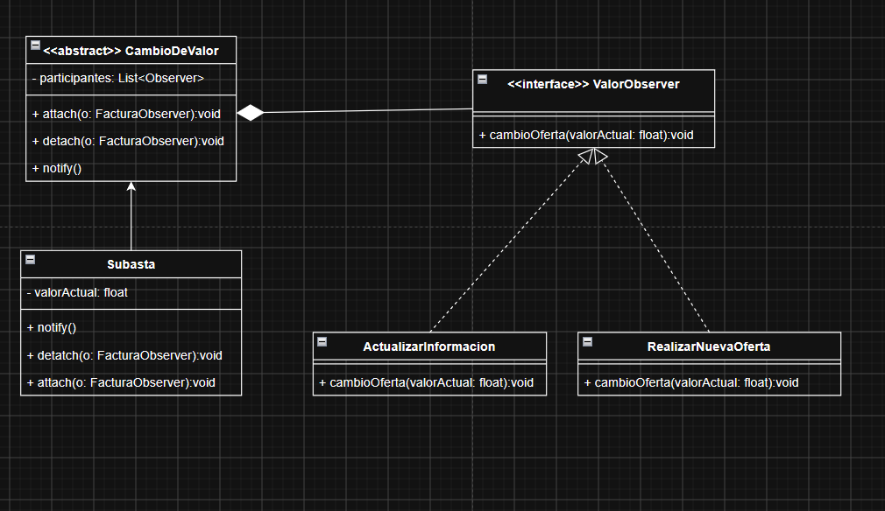

# Unidad 03.02 · Caso 4: subasta electrónica

**Observer es el patrón adecuado y el ejercicio está implementado.** Una `Subasta` mantiene la oferta máxima; cualquier cantidad de participantes puede incorporarse o retirarse sin cambiar su lógica. Cuando acepta una oferta superior, notifica a todos los inscritos mediante una interfaz común.

Fuente principal: [Unidad_03_02_PDS.pdf](../../ClasesDiapositivas/Unidad_03_02_PDS.pdf), estructura de Observer en la página 11 y caso 4 en la página 14. El enunciado no especifica reglas monetarias ni el contenido exacto de la notificación; esas decisiones didácticas se distinguen en [DECISIONES.md](DECISIONES.md).

Recursos: [UML corregido](UML-CORREGIDO.md) · [SVG editable](uml-corregido.svg) · [PNG](uml-corregido.png) · [decisiones](DECISIONES.md) · [prompt reutilizable](PROMPT-FINAL.md).

## Qué estaba bien

Tu UML identifica correctamente los cuatro papeles principales de Observer:

- `CambioDeValor` representa el sujeto y mantiene una colección de observadores.
- `Subasta` representa el sujeto concreto y guarda `valorActual`.
- `ValorObserver` proporciona un contrato común para recibir cambios.
- Las líneas discontinuas con triángulo hueco muestran clases que realizan la interfaz.

También es correcto que la relación entre el sujeto y sus observadores sea uno-a-muchos y que `Subasta` herede del sujeto abstracto. No hace falta cambiar el patrón elegido.

## Modelo implementado

| Participante | Responsabilidad | Código |
|---|---|---|
| `CambioDeValor` | Subject abstracto; administra suscripción, retiro y notificación. | [CambioDeValor.java](src/ejemplo/observer/CambioDeValor.java) |
| `Subasta` | ConcreteSubject; valida ofertas, mantiene el estado y publica cambios. | [Subasta.java](src/ejemplo/observer/Subasta.java) |
| `ValorObserver` | Observer; declara `cambioOferta(estado)`. | [ValorObserver.java](src/ejemplo/observer/ValorObserver.java) |
| `Participante` | ConcreteObserver; recibe el estado y puede realizar otra oferta. | [Participante.java](src/ejemplo/observer/Participante.java) |
| `EstadoSubasta` | Mensaje inmutable con secuencia, ofertante y valor máximo. | [EstadoSubasta.java](src/ejemplo/observer/EstadoSubasta.java) |
| `Main` | Demuestra incorporación, rechazo, retiro y notificación. | [Main.java](src/ejemplo/observer/Main.java) |

Una sola clase `Participante` puede crear muchos observadores concretos: Ana, Bruno, Carla o cualquier otro. Observer exige múltiples objetos interesados, no necesariamente múltiples clases de observador. Los nombres `ActualizarInformacion` y `RealizarNuevaOferta` del dibujo describen acciones. En el modelo corregido ambas son responsabilidades de un participante: `cambioOferta` actualiza su copia y `realizarNuevaOferta` expresa su decisión posterior.

## Flujo de una oferta

1. Un participante llama `realizarNuevaOferta(subasta, valor)`.
2. La llamada llega a `Subasta.realizarOferta(nombre, valor)`.
3. Una oferta nula, no positiva o sin ofertante produce un error. Una oferta igual o menor que la máxima devuelve `false` sin cambiar el estado ni avisar.
4. Una oferta estrictamente mayor actualiza `valorActual`, incrementa el número de oferta aceptada y crea un `EstadoSubasta`.
5. `notifyObservers` recorre una copia de los observadores inscritos y llama `cambioOferta(estado)` en cada uno.
6. Cada participante actualiza su información. Después puede decidir, de manera explícita, presentar una nueva oferta.

La notificación es de tipo *push*: el sujeto entrega los datos necesarios. Por eso el observador no necesita mantener una referencia permanente a `Subasta` para consultar el cambio. Sí recibe la subasta cuando decide ofertar.

`BigDecimal` reemplaza `float` para los importes. Esto conserva exactamente valores decimales como `125.50`. El ejemplo no define escala obligatoria ni redondeo porque no realiza cálculos porcentuales; compara los valores numéricamente mediante `compareTo`.

## Incorporarse y retirarse

`attach` evita registrar dos veces el mismo objeto. `detach` elimina al observador si está inscrito y no falla si ya se había retirado. Una nueva inscripción solo recibe cambios futuros; Observer no implica reproducir automáticamente el último evento.

La notificación usa `List.copyOf(participantes)`. Si un observador se retira durante su callback, los demás todavía reciben el cambio actual y ese observador no recibe el próximo. Si se añade otro durante el aviso, comenzará a recibir desde el siguiente cambio. Esta regla evita modificar la colección que se está recorriendo.

El ejemplo es síncrono: `realizarOferta` termina después de avisar a todos. No es seguro para varios hilos y no intenta ordenar ofertas concurrentes. Tampoco convierte automáticamente una notificación en otra oferta, porque una cadena de observadores contraofertando dentro del callback podría volverse recursiva y difícil de controlar.

## Ejecutar y probar

Requisito: JDK 11 o superior con `java` y `javac` disponibles. Desde la raíz de MSNOTES:

```powershell
& '.\PATRONES DE DISEÑO DE SOFTWARE\Ejercicios\Observer-Caso04-SubastaElectronica\verificar.ps1'
```

Desde la carpeta del ejercicio también funciona `./verificar.ps1`. El [script](verificar.ps1) compila fuentes y pruebas mediante:

```text
javac -encoding UTF-8 --release 11 -Xlint:all
```

Luego ejecuta la demostración y las pruebas con salida UTF-8. No necesita Maven, Gradle, red ni bibliotecas externas. Los compilados se generan en `out/`, ignorado por Git.

Salida representativa:

```text
Ana conoce: 100.00 | notificaciones: 1
Bruno conoce: 100.00 | notificaciones: 1

Ana conoce: 125.50 | notificaciones: 2
Bruno conoce: 125.50 | notificaciones: 2
Carla conoce: 125.50 | notificaciones: 1

Oferta de 120.00 aceptada: false
Ana conoce: 140.00 | notificaciones: 3
Bruno conoce: 125.50 | notificaciones: 2
Carla conoce: 140.00 | notificaciones: 2
```

Bruno conserva `125.50` porque se retiró antes de la oferta de `140.00`. Carla no recibió el primer cambio porque se incorporó después.

## Resultado de las pruebas y límites

**Resultado comprobado: 13/13 pruebas aprobadas**, sin advertencias del compilador, usando OpenJDK 21.0.2 con destino Java 11. Las [pruebas](test/ejemplo/observer/ObserverTest.java) cubren:

- Primera oferta, notificación múltiple y actualización del estado.
- Rechazo de importes iguales o inferiores sin avisos falsos.
- Suscripción tardía, retiro, inscripción duplicada y ausencia de observadores.
- Secuencia exclusiva de ofertas aceptadas y decisión posterior de ofertar.
- Alta o baja de observadores durante una notificación.
- Validación de observadores, participantes e importes.

No se implementan duración o cierre de subasta, lote subastado, incremento mínimo, persistencia, autenticación, ganador definitivo ni concurrencia. Tampoco se captura una excepción lanzada por un observador: al ser una demostración síncrona, esa excepción se propaga. Estas son limitaciones declaradas, no comportamientos prometidos por el enunciado.

## Material original y comparación



También se conserva la [captura del caso](caso-original.png). Los archivos originales no se modificaron. El [UML corregido](UML-CORREGIDO.md) es una propuesta producida durante esta revisión, no una segunda versión atribuida al grupo.

| Aspecto | UML original | UML corregido y código |
|---|---|---|
| Colección | `List<Observer>`. | `List<ValorObserver>`. |
| Suscripción | Recibe `FacturaObserver`, ajeno a la subasta. | `attach/detach(ValorObserver)`. |
| Notificación | `notify()` sin firma completa. | `notifyObservers(EstadoSubasta)`. |
| Sujeto concreto | Repite `attach`, `detach` y `notify`. | Hereda la gestión; añade `realizarOferta`. |
| Importe | `float`. | `BigDecimal`. |
| Observadores concretos | Acciones: actualizar y realizar oferta. | Objeto `Participante` que actualiza y decide ofertar. |
| Datos enviados | Solo `valorActual`. | Estado inmutable con número, ofertante y valor. |

## Correcciones y mejoras de tu UML

1. **Unificar el tipo de observador.** Si la colección guarda `ValorObserver`, `attach` y `detach` también deben recibir `ValorObserver`; `FacturaObserver` pertenece a otro ejemplo y haría inconsistente el modelo.
2. **Cambiar `notify()` por `notifyObservers(estado: EstadoSubasta)`.** En Java, `Object.notify()` es final y se usa para sincronización de hilos, así que una operación sin parámetros con ese nombre no puede redefinirse.
3. **No repetir `attach`, `detach` y la notificación en `Subasta`.** Ya están implementados en la clase base y se heredan. En `Subasta` debe aparecer la operación propia `realizarOferta` y sus datos de estado.
4. **Modelar observadores como objetos con identidad.** Sustituir `ActualizarInformacion` y `RealizarNuevaOferta` por `Participante`; actualizar y ofertar son operaciones del participante, no tipos de participante.
5. **Usar `BigDecimal` para la oferta.** `float` puede introducir imprecisión en valores monetarios. La misma corrección debe aparecer en atributo, parámetros y estado notificado.
6. **Revisar el rombo.** Una asociación o agregación compartida representa mejor que los participantes pueden existir y retirarse independientemente de la subasta; Observer no obliga a una composición de ciclo de vida.
7. **Añadir multiplicidad `0..*` junto a `ValorObserver`** y mantener las realizaciones con línea discontinua y triángulo hueco. La herencia de `Subasta` debe ser una generalización con triángulo hueco dirigido a `CambioDeValor`.
