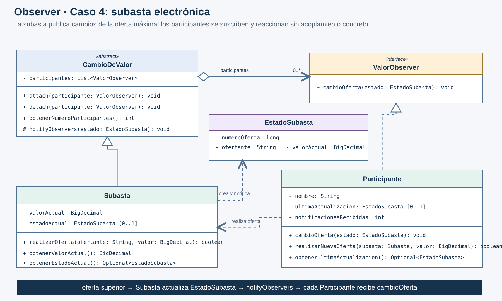
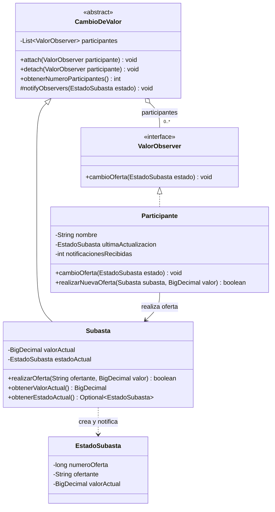

# UML corregido · Observer, subasta electrónica



La imagen es vectorial y editable: [abrir SVG](uml-corregido.svg). La [captura original](uml-original.png) se conserva intacta.

## Versión editable en Mermaid



## Cómo se interpreta

- `CambioDeValor` es el **Subject** abstracto: conoce únicamente la interfaz `ValorObserver`.
- `Subasta` es el **ConcreteSubject**: mantiene la oferta máxima y notifica cuando acepta una superior.
- `ValorObserver` es el contrato de actualización.
- Cada objeto `Participante` es un **ConcreteObserver**. No se necesita una clase distinta por participante ni una clase por cada posible reacción.
- `EstadoSubasta` es el mensaje inmutable enviado en la notificación. Incluye número de oferta aceptada, ofertante y valor actual.

La asociación utiliza agregación compartida (`o--`): los participantes existen independientemente y pueden retirarse. No se usa composición de ciclo de vida. La multiplicidad `0..*` permite una subasta sin inscritos y la incorporación dinámica de nuevos participantes.

El método se llama `notifyObservers`, no `notify`. En Java, `Object.notify()` es `final`; intentar declarar otro `notify()` sin parámetros provocaría un error de compilación. También evita confundir la notificación del patrón con el mecanismo de sincronización de hilos de Java.

El participante actualiza su copia al recibir el aviso y decide después si hace otra oferta mediante `realizarNuevaOferta`. No se oferta automáticamente dentro de `cambioOferta`, porque eso podría crear una cadena recursiva difícil de controlar. El escenario exige que pueda decidir, no que siempre contraoferte.

## Secuencia

```text
Participante → Subasta.realizarOferta(nombre, valor)
  ├─ si valor <= valorActual: devuelve false y no notifica
  └─ si valor > valorActual:
       1. actualiza valorActual
       2. crea EstadoSubasta
       3. notifyObservers(estado)
       4. cada inscrito recibe cambioOferta(estado)
       5. devuelve true
```
