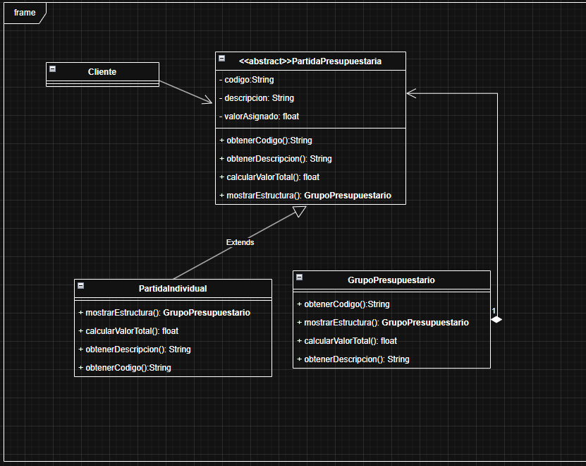
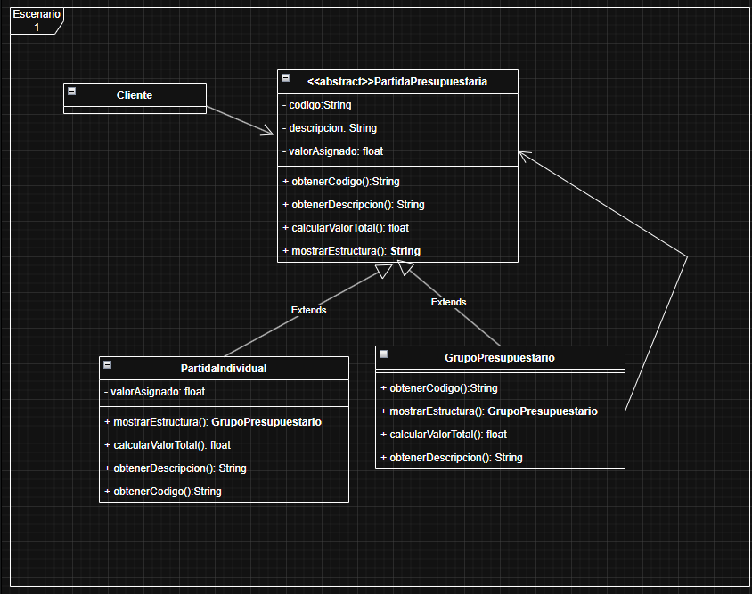
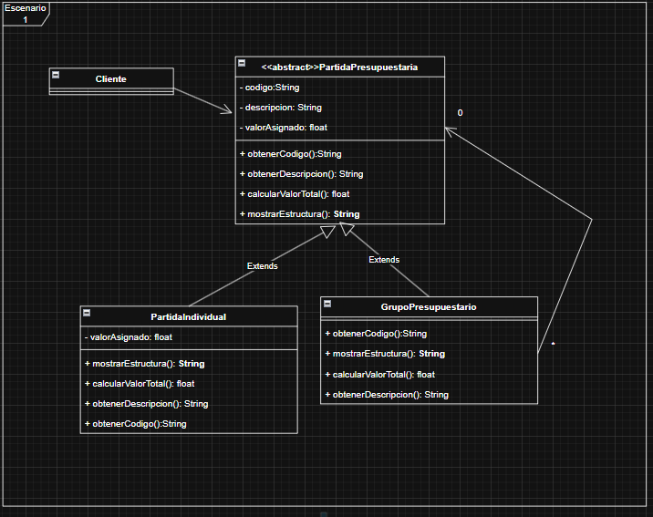

# Tarea 2 · Escenario 1: presupuesto jerárquico

**Composite es el patrón correcto y el ejercicio ya está implementado.** Permite consultar una partida o un grupo con la misma abstracción y calcular recursivamente el presupuesto. Se aplicó la propuesta aceptada mediante «si me parecen bien acepto».

Recursos: [UML aceptado](UML-PROPUESTO.md) · [Decisiones justificadas](DECISIONES.md) · [Prompt final reutilizable](PROMPT-FINAL.md).

## Cómo funciona

| Participante | Responsabilidad | Código |
|---|---|---|
| `PartidaPresupuestaria` | Componente abstracto con código, descripción y operaciones comunes. | [Base](src/ejemplo/composite/PartidaPresupuestaria.java) |
| `PartidaIndividual` | Hoja: su total es `valorAsignado`. | [Hoja](src/ejemplo/composite/PartidaIndividual.java) |
| `GrupoPresupuestario` | Compuesto: conserva hijos, los agrega o retira y suma sus totales. | [Grupo](src/ejemplo/composite/GrupoPresupuestario.java) |
| `Cliente` | Consulta cualquier componente, sin `instanceof` ni decisiones según el tipo. | [Cliente](src/ejemplo/composite/Cliente.java) |
| `Main` | Arma los objetos del ejemplo y demuestra su uso. | [Ejemplo](src/ejemplo/composite/Main.java) |

La colección del grupo es `List<PartidaPresupuestaria>`. Admite partidas y subgrupos porque ambos heredan de la base. Cuando TI solicita el total de Infraestructura, no necesita conocer sus descendientes: Infraestructura calcula su propio total y lo devuelve. Esta delegación se repite para cualquier profundidad.

`mostrarEstructura()` retorna texto con sangría; el cliente decide cuándo imprimirlo. Los getters de código y descripción se heredan. Agregar/quitar pertenece al grupo: una hoja no necesita operaciones de hijos. Esta variante de Composite mantiene uniforme la consulta, no obliga a que una hoja acepte operaciones que no tienen sentido para ella.

En UML, el triángulo hueco de generalización apunta a la base; la asociación del grupo apunta a sus componentes y muestra `0..*` en el extremo de los hijos. Un rombo negro no es requisito del patrón. El modelo aceptado no impone propiedad exclusiva.

## Ejecutar y probar

Desde la raíz de MSNOTES, con `java` y `javac` disponibles:

```powershell
& '.\PATRONES DE DISEÑO DE SOFTWARE\Ejercicios\Tarea2\Escenario1\verificar.ps1'
```

Desde esta carpeta también funciona `./verificar.ps1`. El [script](verificar.ps1) compila `src` y `test` con `--release 11 -encoding UTF-8 -Xlint:all`, ejecuta el ejemplo y las pruebas. Los compilados quedan en `out/`, ignorado por Git. No requiere Maven, Gradle ni bibliotecas externas.

Para repetir únicamente el ejemplo, después de compilar y desde esta carpeta:

```powershell
java -cp out ejemplo.composite.Main
```

La salida principal es:

```text
TI - Tecnologías de la Información: 3500.00
  LIC - Licencias: 500.00
  INF - Infraestructura: 3000.00
    SRV - Servidores: 2000.00
    ALM - Almacenamiento: 1000.00
Total consultado: 3500.00
```

El mismo cliente consulta Licencias y obtiene **500.00**. Al quitar Almacenamiento del subgrupo, el total de TI se recalcula como **2500.00**, sin modificar el cliente.

## Validación y límites

Resultado comprobado: **11/11 pruebas aprobadas**, sin advertencias del compilador, con OpenJDK 21.0.2 y destino Java 11. Las [pruebas](test/ejemplo/composite/CompositeTest.java) cubren hoja, grupo vacío, total y estructura anidados, retirada de componentes, cliente común, ciclos, duplicados, datos inválidos, componentes compartidos y desbordamiento.

Se rechazan ciclos directos e indirectos, hijos nulos y duplicar el mismo objeto como hijo directo. Quitar un hijo ausente no tiene efecto. Los valores deben ser finitos y no negativos; un grupo vacío suma cero. No se comprueba unicidad global de códigos, porque no se definió esa regla.

Se conserva **`float`**, como en el UML aceptado. Formatearlo con dos decimales no elimina su error de representación; este ejemplo no pretende resolver contabilidad monetaria exacta. La alternativa `BigDecimal` queda documentada como recomendación no incorporada, no como rechazo del usuario.

No se impone un padre exclusivo. Compartir un componente entre ramas lo cuenta por cada recorrido; el ejemplo utiliza un árbol. La representación calcula totales durante el recorrido para mantener el código sencillo; no añade cachés ni persistencia.

## Comparación V1 → V2 → V3 → implementación

| Aspecto | V1 | V2 | V3 y cuarta captura | Modelo aceptado y Java |
|---|---|---|---|---|
| Herencia del grupo | Ausente. | Añadida. | Se conserva. | Ambos tipos heredan de la base. |
| `valorAsignado` | En la base. | Se añade también a la hoja. | Sigue duplicado. | Solo en `PartidaIndividual`. |
| `mostrarEstructura()` | Retorna grupo. | La base cambia a `String`. | Las subclases también retornan `String`. | `String` uniforme. |
| Hijos | Relación sin cantidad ni gestión. | Se conserva. | `0` y `*` separados en los extremos. | Rango `0..*`, lista, agregar y quitar. |
| Consulta del cliente | Apunta a la abstracción. | Se conserva. | Se conserva. | Procesa ambos tipos sin distinguirlos. |

Capturas originales, sin modificaciones:








La captura posterior no presenta cambios estructurales frente a V3 y no se le atribuye una versión elegida por el usuario. El [registro de decisiones](DECISIONES.md) distingue aceptaciones, aclaraciones y alternativas no elegidas. No hubo rechazos explícitos. La aprobación final autoriza las correcciones del código y del UML editable; no altera la evidencia original.

## Revisión final: correcciones del UML entregado

1. Quitar `valorAsignado` de la base y mantenerlo únicamente en la hoja. El grupo calcula la suma de sus componentes.
2. Escribir **`0..*` completo junto a `PartidaPresupuestaria`** en la asociación que viene del grupo; el `0` aislado de la captura significa exactamente cero hijos. No repartir un rango entre extremos.
3. Indicar el rol `elementos` y las operaciones `agregar(elemento: PartidaPresupuestaria): void` y `quitar(elemento: PartidaPresupuestaria): void` en el grupo. No hace falta repetir la asociación como atributo si ya está clara.
4. Conservar las dos generalizaciones y el retorno `String`, ya corregidos. Marcar las operaciones abstractas en la base; no hace falta repetir los getters heredados en las subclases.
5. Mantener asociación simple mientras no se defina propiedad exclusiva. Si se optara por un árbol de padre único, esa condición deberá expresarse explícitamente; no se deduce del patrón Composite.
6. Mantener consistentes `float` en atributo y retornos para este ejercicio. Si se eligiera `BigDecimal` para dinero exacto, habría que cambiar todos esos tipos de forma conjunta.
