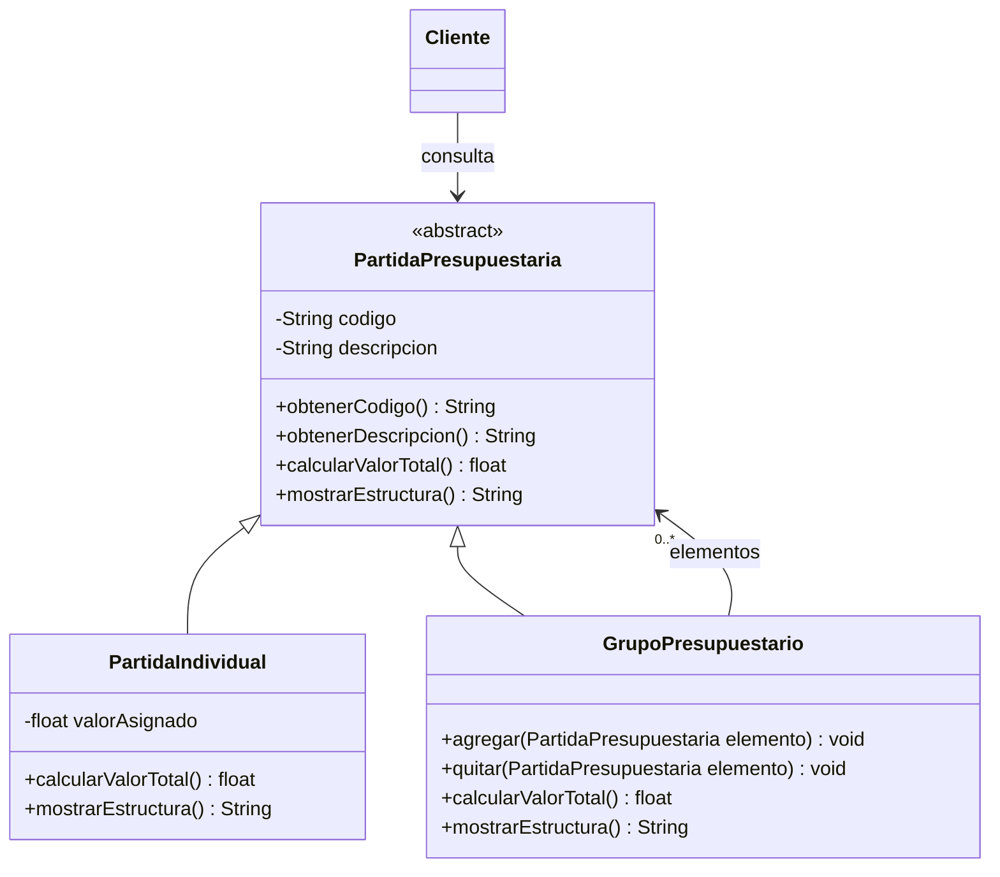

# Escenario 1 · UML aceptado de Composite

Propuesta aceptada por el usuario mediante «si me parecen bien acepto» y utilizada para implementar Java. Se conserva el nombre del archivo para mantener los enlaces de la revisión. Las capturas originales siguen intactas; este diagrama editable expresa las correcciones acordadas y no se presenta como una captura modificada por el usuario.

El grupo guarda sus hijos en una colección. Cada hijo puede ser una partida o un grupo; al calcular el total, el grupo suma `calcularValorTotal()` de todos sus hijos. Un grupo vacío suma cero. Los getters se heredan de la base; no necesitan repetirse en las subclases. Las operaciones de total y estructura son abstractas en la base.

El rango `0..*` está completo en el extremo de los hijos. No se impone aquí un número de padres ni propiedad exclusiva: ese detalle no quedó acordado. Los ciclos deben impedirse para que el recorrido termine.

Se conserva `float` en el diagrama y en Java, conforme a la propuesta aceptada. Para importes monetarios exactos conviene `BigDecimal`; esa alternativa no se adoptó en este ejercicio ni se registra como rechazo explícito del usuario. `contiene(elemento)` es un auxiliar protegido de implementación para prevenir ciclos; no añade responsabilidades al cliente.

## Cambios y estado

| Cambio | Estado |
|---|---|
| Retirar el valor de la base y dejarlo en la hoja | Aceptado previamente; aún pendiente en la captura. |
| Retorno `String` y herencia de ambos componentes | Ya aplicados en V3 y conservados. |
| Asociación con varios hijos | La captura intenta expresar la cantidad; se corrige la notación del rango. |
| Agregar y quitar componentes | Aceptado en la confirmación final e implementado. |

No se interpreta el reenvío de la captura como rechazo de las recomendaciones.

El grupo rechaza insertar dos veces el mismo objeto como hijo directo. No impone un padre exclusivo; si se comparte un componente entre ramas, se suma por cada recorrido. El ejemplo construye un árbol sin componentes compartidos.
