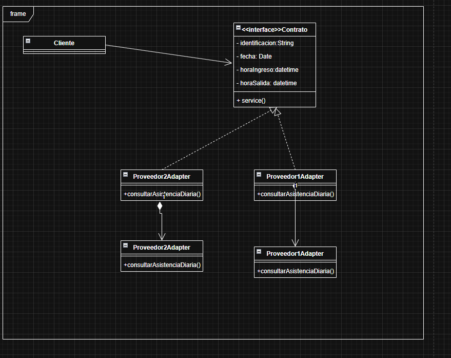
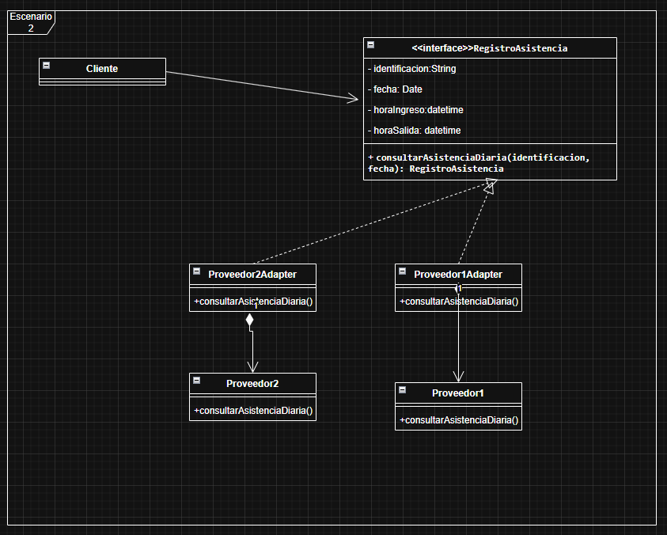
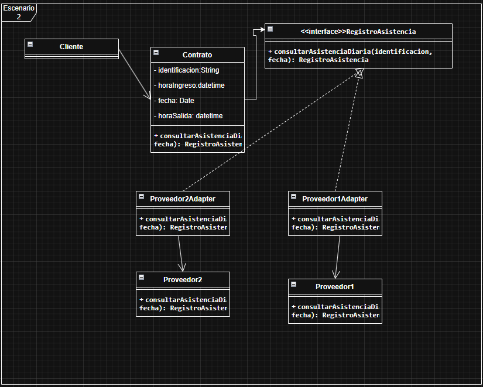
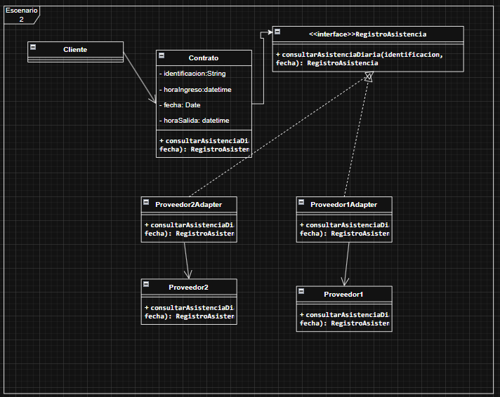

# Tarea 2 · Escenario 2: asistencia institucional

**Adapter es el patrón correcto y el ejercicio ya está implementado.** El sistema consulta una interfaz estable mientras los adaptadores encapsulan los proveedores. Se aplicó la propuesta aceptada mediante «si me parecen bien acepto», incluida la regla de primera entrada y última salida.

Recursos: [UML aceptado](UML-PROPUESTO.md) · [Decisiones justificadas](DECISIONES.md) · [Prompt final reutilizable](PROMPT-FINAL.md).

## Participantes y separación de responsabilidades

| Participante | Responsabilidad | Código |
|---|---|---|
| `Contrato` | Interfaz institucional o Target; declara la consulta por identificación y fecha. | [Interfaz](src/ejemplo/adapter/Contrato.java) |
| `RegistroAsistencia` | Resultado inmutable con identificación, fecha y horas opcionales. No consulta dispositivos. | [Resultado](src/ejemplo/adapter/RegistroAsistencia.java) |
| `Cliente` | Recibe un `Contrato` y presenta el resultado sin conocer clases del fabricante. | [Cliente](src/ejemplo/adapter/Cliente.java) |
| `Proveedor1Adapter` | Mantiene la envoltura elegida para el proveedor ya compatible. | [Adaptador 1](src/ejemplo/adapter/Proveedor1Adapter.java) |
| `Proveedor2Adapter` | Convierte parámetros, filtra marcas y construye el resultado institucional. | [Adaptador 2](src/ejemplo/adapter/Proveedor2Adapter.java) |
| `Proveedor1` | Simula el proveedor antiguo con resultados ya normalizados. | [Proveedor 1](src/ejemplo/adapter/proveedores/Proveedor1.java) |
| `Proveedor2` | Simula la biblioteca externa, o Adaptee, con una API diferente. | [Proveedor 2](src/ejemplo/adapter/proveedores/Proveedor2.java) |
| `MarcacionProveedor2` | Dato propio del fabricante: documento, instante ISO y tipo. | [Marcación](src/ejemplo/adapter/proveedores/MarcacionProveedor2.java) |

La consulta institucional es `consultarAsistenciaDiaria(String identificacion, LocalDate fecha): RegistroAsistencia`. El proveedor nuevo expone `recuperarMarcaciones(String documento, String fechaISO): List<MarcacionProveedor2>`. Son diferentes tanto los parámetros como la estructura del resultado.

En UML, los adaptadores realizan la interfaz mediante línea discontinua y triángulo hueco apuntando a `Contrato`. Cada uno guarda una referencia privada a su proveedor. `Contrato` depende del tipo `RegistroAsistencia` porque lo devuelve; la clase de datos no tiene una flecha hacia el servicio ni una operación de consulta. El cliente depende de la interfaz.

Se conservan los dos adaptadores por la elección del grupo. El proveedor antiguo no necesita transformar datos: su envoltura delega. Integrarlo directamente al contrato también habría sido válido, pero no fue la alternativa elegida.

## Transformación paso a paso

1. El cliente entrega identificación y `LocalDate` a `Contrato`.
2. El adaptador nuevo convierte la fecha a texto ISO y llama a la biblioteca.
3. Recorre las marcas de la persona y fecha solicitadas, interpretando su instante ISO local.
4. De las marcas `ENTRADA` conserva la hora menor; de las marcas `SALIDA`, la mayor. No importa el orden de llegada ni que haya marcas repetidas.
5. Devuelve un `RegistroAsistencia`. Si falta un tipo de marca, esa hora queda ausente; sin marcas conserva identificación y fecha con ambas horas ausentes.

Los campos internos de horas pueden ser `null`, pero los getters entregan `Optional<LocalTime>`. El cliente presenta «sin registro». Los errores del dispositivo o datos malformados no se convierten silenciosamente en ausencias.

## Ejecutar y probar

Desde la raíz de MSNOTES, con JDK 11 o superior:

```powershell
& '.\PATRONES DE DISEÑO DE SOFTWARE\Ejercicios\Tarea2\Escenario2\verificar.ps1'
```

Desde esta carpeta también funciona `./verificar.ps1`. El [script](verificar.ps1) compila con `--release 11 -encoding UTF-8 -Xlint:all`, ejecuta [Main](src/ejemplo/adapter/Main.java) y las [pruebas](test/ejemplo/adapter/AdapterTest.java). Los compilados se guardan en `out/`, ignorado por Git. No requiere dependencias externas.

Para repetir solo la demostración, desde esta carpeta después de compilar:

```powershell
java -cp out ejemplo.adapter.Main
```

Salida comprobada con datos ficticios:

```text
Proveedor compatible: COL001 | 2026-09-23 | ingreso: 08:00 | salida: 17:00
Proveedor adaptado: COL001 | 2026-09-23 | ingreso: 08:05 | salida: 17:15
Sin salida: COL002 | 2026-09-23 | ingreso: 08:20 | salida: sin registro
Sin marcas: COL003 | 2026-09-23 | ingreso: sin registro | salida: sin registro
```

## Validación y alcance

Resultado comprobado: **12/12 pruebas aprobadas**, sin advertencias del compilador, con OpenJDK 21.0.2 y destino Java 11. Se verificaron delegación, extremos desordenados, ausencia parcial/total, conversión de parámetros, filtrado por persona y fecha, cliente común, marcas repetidas, datos inválidos, fallos del dispositivo y consultas inválidas.

Los proveedores son **simulaciones locales**; no se conectó un biométrico ni un SDK real. La biblioteca nueva no depende del contrato institucional; el adaptador utiliza su API como si fuera fija. Las firmas del fabricante y los ejemplos son elaboración didáctica aceptada, no detalles proporcionados por el enunciado.

La regla trabaja con una fecha local y tipos `ENTRADA`/`SALIDA`. No calcula horas laborales, no empareja pausas ni une turnos que cruzan medianoche. Tampoco convierte zonas horarias. Una salida anterior al ingreso no se corrige inventando datos. Los tipos desconocidos o instantes inválidos provocan errores; no significan «sin asistencia».

## Comparación V1 → V2 → V3 → implementación

| Aspecto | V1 | V2 | V3 y cuarta captura | Modelo aceptado y Java |
|---|---|---|---|---|
| Contrato y datos | Interfaz `Contrato` con atributos y `service()`. | Interfaz renombrada `RegistroAsistencia`, todavía con datos. | Se añade clase `Contrato` con datos y consulta; interfaz conserva nombre del resultado. | Interfaz `Contrato`; clase separada `RegistroAsistencia`. |
| Cliente | Apunta a la interfaz. | Apunta a la interfaz. | Apunta a la clase con datos. | Consulta a través de `Contrato`. |
| Firma | Operaciones incompatibles entre interfaz y adaptadores. | Interfaz mejorada, adaptadores incompletos. | Se amplían firmas, pero la captura corta texto. | Firma común completa en interfaz y adaptadores. |
| Proveedores | Cajas inferiores duplican nombres de adaptadores. | Se diferencian `Proveedor1` y `Proveedor2`. | Se conserva. | Nombres y responsabilidades separados. |
| API del fabricante nuevo | Igual consulta diaria. | Igual consulta diaria. | Igual consulta diaria. | Recupera una colección mediante su API propia. |
| Adaptadores | Dos. | Dos. | Dos. | Se mantienen ambos. |

Capturas originales, sin modificaciones:









No se observan cambios estructurales entre V3 y la captura posterior. La comparación registra lo que aparece en cada imagen, no lo que posteriormente se aceptó para el código. Las dudas se documentan como aclaraciones; no se atribuyen rechazos ni motivaciones inexistentes. El acuerdo final y sus razones técnicas están en [DECISIONES.md](DECISIONES.md).

## Revisión final: correcciones del UML entregado

1. Llamar `Contrato` a la interfaz y `RegistroAsistencia` a la clase con datos. El punto funcional es separar servicio y respuesta; los nombres por sí solos no aplican el patrón.
2. Quitar la consulta de la clase de datos y su flecha hacia el servicio. El cliente debe apuntar a `Contrato`; la consulta devuelve un `RegistroAsistencia`.
3. Completar la misma firma con identificación, fecha y retorno en interfaz y adaptadores. Ampliar las cajas para que los parámetros y tipos puedan leerse completos.
4. Mostrar en `Proveedor2` su operación `recuperarMarcaciones(documento: String, fechaISO: String): List<MarcacionProveedor2>`. El algoritmo de filtrado y selección pertenece al código, pero el UML debe evidenciar la interfaz incompatible.
5. Conservar ambos adaptadores y representar sus referencias privadas al proveedor. Una asociación navegable es suficiente; no se necesita imponer composición de ciclo de vida.
6. Indicar `LocalDate` para la fecha y `LocalTime [0..1]` para cada hora del resultado. La ausencia es un dato posible; no equivale a medianoche ni a un error del fabricante.
