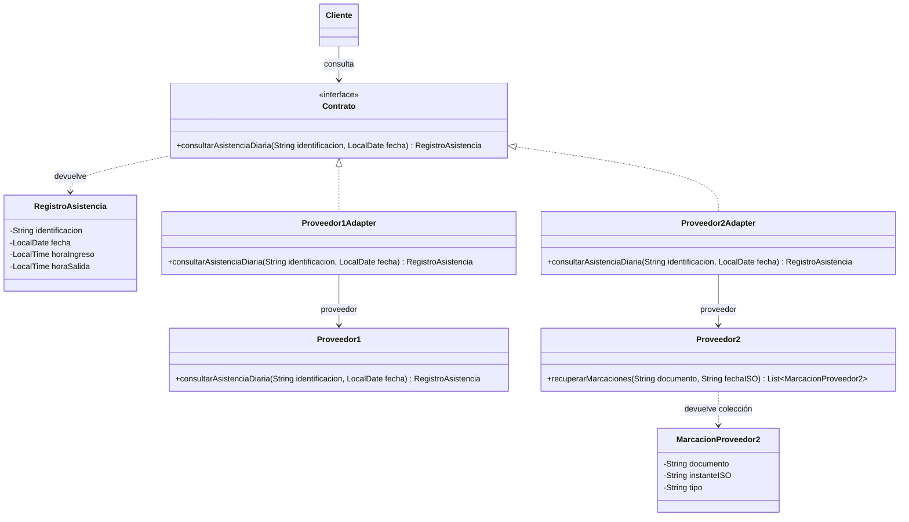

# Escenario 2 · UML aceptado de Adapter

Propuesta aceptada por el usuario mediante «si me parecen bien acepto» y utilizada para implementar Java. Se conservan los dos adaptadores y el nombre de este archivo para mantener los enlaces de la revisión. Las capturas originales siguen intactas; el diagrama editable expresa el acuerdo final y no es una captura modificada por el usuario.

El cliente solicita una consulta a `Contrato`. El objeto que atiende puede ser cualquiera de los dos adaptadores. El resultado es una instancia de la clase `RegistroAsistencia`, que contiene datos y no realiza consultas. No existe una asociación desde el resultado hacia el servicio.

Los nombres originales están intercambiados en la última captura respecto de esta propuesta: la interfaz pasaría a llamarse `Contrato` y la clase de datos `RegistroAsistencia`. El objetivo funcional es separar el servicio del resultado; el patrón no impone nombres específicos.

El primer adaptador delega al proveedor compatible. El segundo convierte los parámetros a la interfaz propia del fabricante y transforma una colección de marcaciones en el resultado institucional. Esa diferencia de tipos y operaciones hace visible qué se adapta. La biblioteca del fabricante no implementa el contrato institucional ni se modifica para ello.

Las firmas del fabricante y el tipo `MarcacionProveedor2` son una simulación didáctica aceptada, no datos aportados por el enunciado. Las horas del resultado pueden estar ausentes (`[0..1]`); los getters Java usan `Optional<LocalTime>` para expresarlo. Los constructores y getters se omiten del diagrama para concentrarlo en los participantes y operaciones del patrón.

## Regla de normalización aceptada

Se usan marcas con tipo `ENTRADA` o `SALIDA`, se filtra por persona y fecha, se toma la primera entrada y la última salida y se deja ausente una hora si no hay una marca del tipo correspondiente. Sin marcas, el registro conserva persona y fecha con ambas horas ausentes. El usuario aceptó esta regla para el ejemplo; no es una política institucional suministrada por el enunciado.

## Cambios y estado

| Cambio | Estado |
|---|---|
| Conservar dos adaptadores | Se mantiene la organización de las capturas. |
| Distinguir nombres de proveedores y adaptadores | Aceptado y aplicado desde V2. |
| Unificar firma institucional | Aceptado; algunas firmas de la captura siguen cortadas. |
| Clase de datos separada y consulta dirigida a la interfaz | Aceptada en la confirmación final e implementada. |
| Interfaz propia del proveedor nuevo y regla de normalización | Aceptadas en la confirmación final e implementadas. |

No se atribuyen rechazos ni motivos personales que el grupo no haya expresado.
