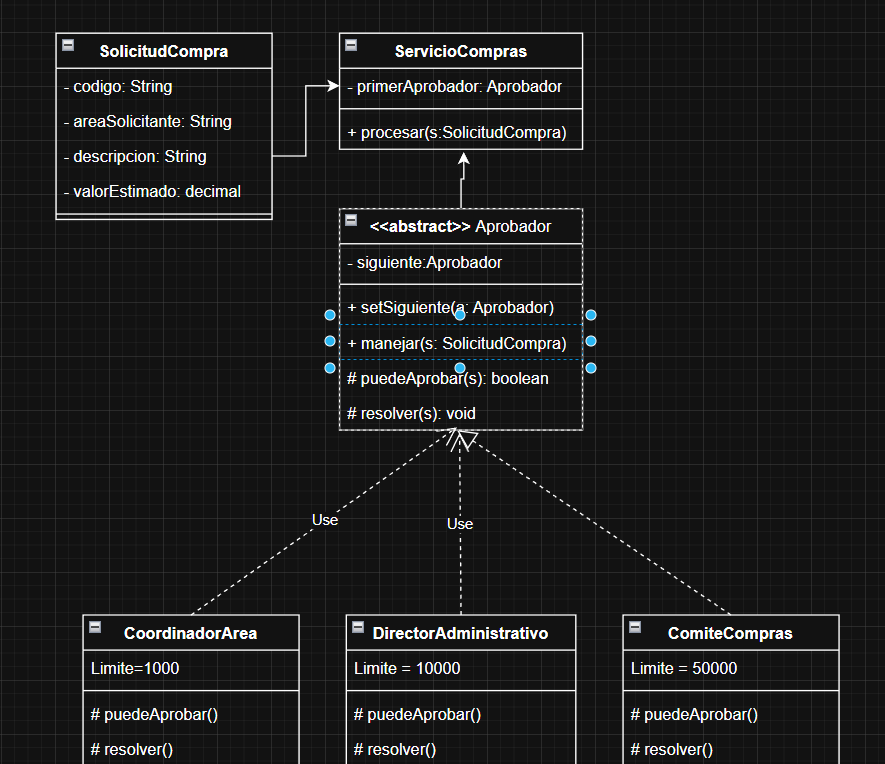

# Tarea 3 · Escenario 1: aprobación escalonada de compras

**Chain of Responsibility es adecuado para este escenario.** Una solicitud se entrega al primer aprobador y avanza hasta encontrar un nivel con autoridad suficiente. El servicio no contiene una secuencia de condiciones ni conoce cuál de los tres niveles terminará resolviendo.

Recursos: [escenario y justificación](ESCENARIO.md) · [UML final aceptado](uml-final.png) · [correspondencia con Java](UML-IMPLEMENTADO.md) · [decisiones](DECISIONES.md) · [prompt final](PROMPT-FINAL.md).

## Participantes e implementación

| Rol del patrón | Clase | Responsabilidad |
|---|---|---|
| Request | [`SolicitudCompra`](src/ejemplo/chain/SolicitudCompra.java) | Conserva código, área, descripción y valor estimado. |
| Handler | [`Aprobador`](src/ejemplo/chain/Aprobador.java) | Decide si resuelve o delega al siguiente. |
| ConcreteHandler | [`CoordinadorArea`](src/ejemplo/chain/CoordinadorArea.java) | Aprueba hasta 1.000. |
| ConcreteHandler | [`DirectorAdministrativo`](src/ejemplo/chain/DirectorAdministrativo.java) | Aprueba hasta 10.000. |
| ConcreteHandler | [`ComiteCompras`](src/ejemplo/chain/ComiteCompras.java) | Aprueba hasta 50.000. |
| Client | [`ServicioCompras`](src/ejemplo/chain/ServicioCompras.java) | Envía la solicitud al primer manejador configurado. |
| Resultado auxiliar | [`ResultadoAprobacion`](src/ejemplo/chain/ResultadoAprobacion.java) | Informa si fue aprobada, responsable y mensaje. |

`Aprobador.manejar` contiene el algoritmo común. Si `puedeAprobar` es verdadero, llama a `resolver` y termina. Si no, envía la misma petición al siguiente. Cuando no existe siguiente, devuelve un resultado no aprobado. Las subclases solo conocen su límite y el nombre del nivel que representan.

El resultado auxiliar no se añadió al UML conceptual por decisión del usuario; se incorporó en Java para que `ServicioCompras.procesar` pueda devolver un desenlace sin exponer los manejadores concretos.

## Ejecutar y probar

Desde la raíz de MSNOTES:

```powershell
& '.\PATRONES DE DISEÑO DE SOFTWARE\Ejercicios\Tarea3\Escenario1-Chain-of-Responsibility\verificar.ps1'
```

El [script](verificar.ps1) compila `src` y `test` con `--release 11 -encoding UTF-8 -Xlint:all`, ejecuta el ejemplo y luego las pruebas. No requiere Maven, Gradle ni bibliotecas externas.

Salida del ejemplo:

```text
SC-001 (850.00): Aprobada por Coordinador de área
SC-002 (7500.00): Aprobada por Director administrativo
SC-003 (40000.00): Aprobada por Comité de compras
SC-004 (70000.00): Ningún nivel de la cadena tiene autoridad suficiente
```

Resultado comprobado: **12/12 pruebas aprobadas**, sin advertencias, con OpenJDK 21.0.2 y destino Java 11. Las pruebas incluyen límites exactos, delegación, final sin responsable, cadena configurable, detención en el primer aprobador, datos inválidos y referencias nulas.

## Validación crítica

El patrón resolvió la selección del responsable sin acoplar `ServicioCompras` a las tres autoridades. Frente a un bloque `if/else`, permite cambiar el orden u omitir un nivel mediante la configuración de enlaces. Añade más objetos y obliga a inspeccionar la cadena para saber quién atenderá una cantidad concreta.

No lo recomendaría cuando existe una sola autoridad estable o una regla corta que nunca cambia. Esta variante tampoco representa aprobaciones acumulativas: aquí **un solo nivel resuelve y detiene el recorrido**.

## Comparación V1 → UML final → Java

| Aspecto | V1 | UML final aceptado | Java |
|---|---|---|---|
| Operación provisional | `method(type): type` en `SolicitudCompra`. | Eliminada. | No existe. |
| Participantes principales | Solicitud, servicio, aprobador y tres niveles. | Se conservan. | Se implementan con los mismos nombres. |
| Herencia | Se dibuja como realización con `Use`. | Se conserva por decisión del usuario. | Las tres clases usan `extends Aprobador`. |
| Siguiente nivel | Campo `siguiente: Aprobador`. | Se conserva. | Referencia opcional; el último queda sin siguiente. |
| Retorno del proceso | No se especifica. | Se conserva conceptual. | `ResultadoAprobacion` comunica el desenlace. |
| Dinero y límites | `decimal` y límites sin tipo. | Se conserva conceptual. | `BigDecimal` y constantes tipadas. |

Capturas originales:




La única modificación visual aceptada fue eliminar la operación provisional. Los demás detalles se trasladaron al código; el [registro](DECISIONES.md) explica la decisión sin presentarla como un error pendiente.

[Volver al índice de Tarea 3](../README.md)
