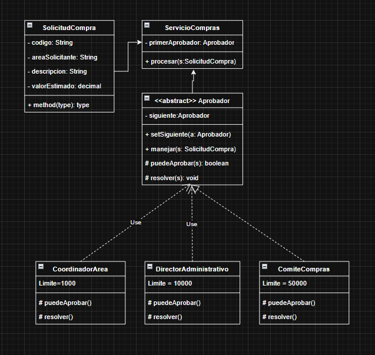

# Revisión del UML V1 · Chain of Responsibility

> **Estado posterior:** esta es la revisión histórica de V1. El usuario aceptó eliminar la operación provisional y decidió conservar los demás detalles como parte del código. Consulta el [registro final de decisiones](DECISIONES.md).

## Evaluación general

El patrón seleccionado es correcto. El modelo ya contiene la petición (`SolicitudCompra`), un manejador abstracto (`Aprobador`), tres manejadores concretos y un cliente (`ServicioCompras`). También ubica los límites en cada nivel y conserva en el manejador la referencia al siguiente eslabón, que son las ideas centrales de **Chain of Responsibility**.

Antes de programar conviene completar el resultado del proceso, corregir algunas relaciones y precisar las firmas. Estos ajustes no cambian el escenario: hacen explícito cómo una solicitud avanza, se resuelve y comunica el resultado al cliente.

## Correcciones recomendadas para la versión final

| Elemento de V1 | Corrección propuesta | Motivo |
|---|---|---|
| Las clases concretas se conectan a `Aprobador` con línea discontinua y la etiqueta `Use`. | Dibujar **generalización**: línea continua desde cada clase concreta y triángulo blanco apuntando a `Aprobador`. | Las clases heredan de una clase abstracta; no es una dependencia de uso. |
| `ServicioCompras` tiene `primerAprobador: Aprobador`, pero la flecha parece ir desde `Aprobador` al servicio. | Mostrar una asociación navegable `ServicioCompras --> Aprobador`, con el rol `primerAprobador` y multiplicidad `1`. | Es el servicio quien conserva y utiliza al primer elemento de la cadena. |
| La relación entre `SolicitudCompra` y `ServicioCompras` parece una asociación dirigida hacia el servicio. | Mostrar una dependencia `ServicioCompras ..> SolicitudCompra : procesa`, o dejar que la dependencia se deduzca del parámetro. | La solicitud no conoce al servicio; el servicio recibe una solicitud. |
| `Aprobador.siguiente` no muestra opcionalidad. | Añadir una autorrelación navegable `Aprobador --> Aprobador` con rol `siguiente` y multiplicidad `0..1`. | El último aprobador no tiene sucesor. |
| `procesar`, `manejar`, `resolver` y `setSiguiente` no tienen tipo de retorno completo. | Usar las firmas indicadas en la sección siguiente. | El UML debe permitir deducir el contrato que implementará Java. |
| `SolicitudCompra` contiene `method(type): type`. | Eliminar esa operación provisional. | Es texto de plantilla y no representa una responsabilidad del dominio. |
| `valorEstimado: decimal`. | Usar `BigDecimal` en el modelo orientado a Java. | Evita errores de precisión al representar dinero. |
| Los límites aparecen como `Limite = ...` sin visibilidad ni tipo. | Escribir, por ejemplo, `- LIMITE: BigDecimal = 1000.00` en cada clase. | Declara el tipo y deja claro que el límite es un dato interno del manejador. |
| No existe un objeto que comunique quién resolvió o por qué no se resolvió. | Añadir `ResultadoAprobacion`. | Sin un resultado común, `ServicioCompras` no puede informar de forma limpia el desenlace. |

## Firmas sugeridas

### SolicitudCompra

- `- codigo: String`
- `- areaSolicitante: String`
- `- descripcion: String`
- `- valorEstimado: BigDecimal`

### ResultadoAprobacion

- `- aprobada: boolean`
- `- responsable: String [0..1]`
- `- mensaje: String`

La multiplicidad `0..1` indica que una solicitud superior al límite final puede no tener responsable.

### ServicioCompras

- `- primerAprobador: Aprobador`
- `+ procesar(s: SolicitudCompra): ResultadoAprobacion`

### Aprobador

- `- siguiente: Aprobador [0..1]`
- `+ setSiguiente(a: Aprobador): Aprobador`
- `+ manejar(s: SolicitudCompra): ResultadoAprobacion`
- `# puedeAprobar(s: SolicitudCompra): boolean`
- `# resolver(s: SolicitudCompra): ResultadoAprobacion`

Devolver `Aprobador` desde `setSiguiente` permite configurar la cadena de forma encadenada. También sería válido devolver `void`; si se elige esa alternativa, UML y Java deben mantener la misma firma.

### Manejadores concretos

Cada uno redefine:

- `# puedeAprobar(s: SolicitudCompra): boolean`
- `# resolver(s: SolicitudCompra): ResultadoAprobacion`

Los límites serían `1000.00`, `10000.00` y `50000.00`, respectivamente.

## Colaboración que debe conservarse

`ServicioCompras` envía la solicitud únicamente a `primerAprobador`. `Aprobador.manejar` aplica la secuencia común: si `puedeAprobar` devuelve verdadero, retorna `resolver`; de lo contrario, delega al siguiente. Cuando no existe siguiente, crea un `ResultadoAprobacion` no aprobado. En cuanto un manejador resuelve la solicitud, el recorrido termina.

Esto permite que el servicio conozca el contrato abstracto y evita una cadena de condiciones con las tres clases concretas.

## Decisión importante incorporada en la recomendación

Se recomienda añadir `ResultadoAprobacion` y hacer que `procesar` y `manejar` lo devuelvan. No altera los límites ni el orden del proceso; completa una parte necesaria del escenario: informar si la compra fue aprobada, qué nivel la aprobó o por qué quedó sin resolver.

## Lista breve para revisar la versión final

- [ ] Las tres clases concretas heredan con línea continua de `Aprobador`.
- [ ] `ServicioCompras` navega hacia un `primerAprobador`.
- [ ] `Aprobador` navega hacia `0..1` siguiente.
- [ ] Todas las operaciones muestran parámetros y retornos.
- [ ] `ResultadoAprobacion` está incluido.
- [ ] No quedan operaciones de plantilla como `method(type): type`.
- [ ] Los importes y límites utilizan `BigDecimal`.

[Volver al escenario](ESCENARIO.md) · [Volver al índice](../README.md)
