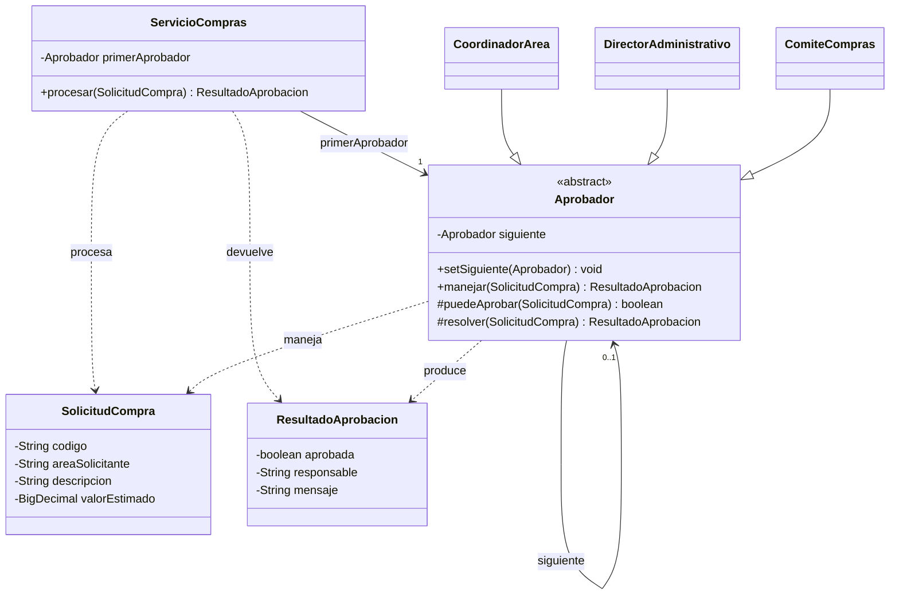

# Correspondencia del código · Chain of Responsibility

El [UML final aceptado](uml-final.png) es el modelo conceptual entregado por el usuario. Este diagrama complementario muestra los tipos y retornos que se trasladaron exclusivamente a Java.

Este recurso no reemplaza ni modifica la captura final; sirve para revisar la correspondencia exacta con las firmas del código.
