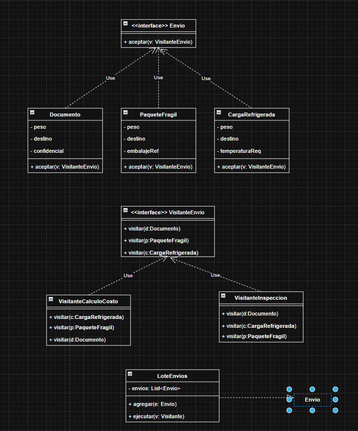

# Revisión del UML V1 · Visitor

> **Estado posterior:** esta es la revisión histórica de V1. El usuario decidió conservar la captura como UML final conceptual y trasladar las precisiones de tipos, conexiones y resultados al código. Consulta el [registro final de decisiones](DECISIONES.md).

## Evaluación general

El patrón elegido es correcto y su estructura principal ya está presente. `Envio` representa el elemento, las tres clases concretas implementan `aceptar`, `VisitanteEnvio` declara una visita sobre cada tipo y los dos visitantes concretos realizan esa interfaz. Esta combinación permite aplicar el **doble despacho** sin utilizar `instanceof`.

La versión final debe completar los tipos y resultados, alinear los atributos con el escenario acordado y corregir la relación de `LoteEnvios` con la interfaz original.

## Correcciones recomendadas para la versión final

| Elemento de V1 | Corrección propuesta | Motivo |
|---|---|---|
| `aceptar(v: VisitanteEnvio)` no muestra retorno. | Añadir `: void` en la interfaz y en los tres elementos. | `aceptar` dirige la visita; el visitante conserva el resultado. |
| Los métodos `visitar(...)` no muestran retorno. | Añadir `: void` en la interfaz y en ambos visitantes. | Mantiene un contrato uniforme con visitantes que acumulan resultados. |
| Los atributos de los envíos no tienen tipos. | Añadir los tipos que aparecen en la sección siguiente. | El UML debe corresponder de forma inequívoca con Java. |
| `PaqueteFragil` no incluye `valorDeclarado`. | Añadirlo y conservar `embalajeReforzado`. | El valor se necesita para calcular el seguro acordado. |
| `CargaRefrigerada` muestra `peso` y `destino`, pero no `volumen` ni `distancia`. | Añadir `volumenLitros`, `distanciaKm` y `temperaturaRequerida`. | Esos datos intervienen en la fórmula definida para el ejercicio. |
| Los visitantes concretos no muestran dónde queda su resultado. | Añadir `total` y `obtenerTotal()` al visitante de costo; añadir `resultados` y `obtenerResultados()` al de inspección. | Una operación `void` necesita un modo explícito de consultar lo producido. |
| `LoteEnvios.ejecutar(v: Visitante)` usa un tipo inexistente. | Cambiarlo por `ejecutar(v: VisitanteEnvio): void`. | Debe usar exactamente el contrato Visitor del diagrama. |
| Hay una segunda caja `Envio` aislada junto a `LoteEnvios`. | Eliminar la caja duplicada y conectar `LoteEnvios` con la interfaz `Envio` superior. | Solo debe existir un elemento abstracto común. |
| La colección no muestra multiplicidad en la relación. | Dibujar `LoteEnvios 1 o-- 0..* Envio`, con rol `envios`. | Expresa que un lote mantiene cero o más envíos. Una asociación simple también sería válida. |
| Las realizaciones llevan la etiqueta `Use`. | Mantener la línea discontinua con triángulo blanco y quitar `Use`. | Esa notación significa realización de interfaz, no dependencia de uso. |

## Firmas y atributos sugeridos

### Envio

- `+ aceptar(v: VisitanteEnvio): void`

### Documento

- `- pesoGramos: int`
- `- destino: String`
- `- confidencial: boolean`
- `+ aceptar(v: VisitanteEnvio): void`

### PaqueteFragil

- `- pesoKg: BigDecimal`
- `- valorDeclarado: BigDecimal`
- `- embalajeReforzado: boolean`
- `+ aceptar(v: VisitanteEnvio): void`

### CargaRefrigerada

- `- volumenLitros: BigDecimal`
- `- distanciaKm: BigDecimal`
- `- temperaturaRequerida: BigDecimal`
- `+ aceptar(v: VisitanteEnvio): void`

### VisitanteEnvio

- `+ visitar(d: Documento): void`
- `+ visitar(p: PaqueteFragil): void`
- `+ visitar(c: CargaRefrigerada): void`

### VisitanteCalculoCosto

- `- total: BigDecimal`
- Las tres operaciones `visitar(...): void`
- `+ obtenerTotal(): BigDecimal`

### VisitanteInspeccion

- `- resultados: List<String>`
- Las tres operaciones `visitar(...): void`
- `+ obtenerResultados(): List<String>`

### LoteEnvios

- `- envios: List<Envio>`
- `+ agregar(e: Envio): void`
- `+ ejecutar(v: VisitanteEnvio): void`

## Colaboración que debe conservarse

Cada elemento concreto implementa `aceptar` llamando a la sobrecarga que le corresponde: `Documento` ejecuta `v.visitar(this)`, y las otras clases hacen lo mismo con su propio tipo. `LoteEnvios` solo recorre la colección e invoca `aceptar`; no pregunta el tipo de cada objeto.

El visitante de costo acumula un importe y el de inspección acumula mensajes. Así pueden aplicarse al mismo lote sin introducir `calcularCosto()` o `inspeccionar()` dentro de cada envío.

## Decisiones importantes incorporadas en la recomendación

Se propone mantener operaciones `void` y almacenar el resultado en cada visitante. Esta opción corresponde al Visitor clásico y evita convertir `aceptar` en un método genérico más complejo. Además, se mantienen las reglas ya acordadas; por eso `PaqueteFragil` necesita valor declarado y `CargaRefrigerada` necesita volumen y distancia.

## Lista breve para revisar la versión final

- [ ] Existe una sola interfaz `Envio`.
- [ ] Las tres clases concretas realizan `Envio`.
- [ ] Cada `aceptar` y cada `visitar` retorna `void`.
- [ ] `VisitanteCalculoCosto` expone su total.
- [ ] `VisitanteInspeccion` expone sus resultados.
- [ ] `LoteEnvios` contiene `0..*` objetos `Envio` y recibe `VisitanteEnvio`.
- [ ] Los atributos necesarios para costo e inspección están visibles con su tipo.
- [ ] No se utiliza `instanceof` para seleccionar la operación.

[Volver al escenario](ESCENARIO.md) · [Volver al índice](../README.md)
