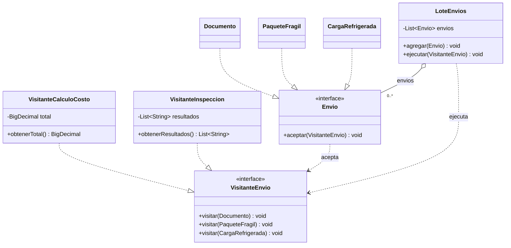

# Correspondencia del código · Visitor

El [UML final aceptado](uml-final.png) permanece como modelo conceptual. Este diagrama complementario documenta los tipos, conexiones y resultados trasladados exclusivamente a Java.

Este recurso explica la implementación; no se atribuye al usuario como un UML redibujado o aceptado.
