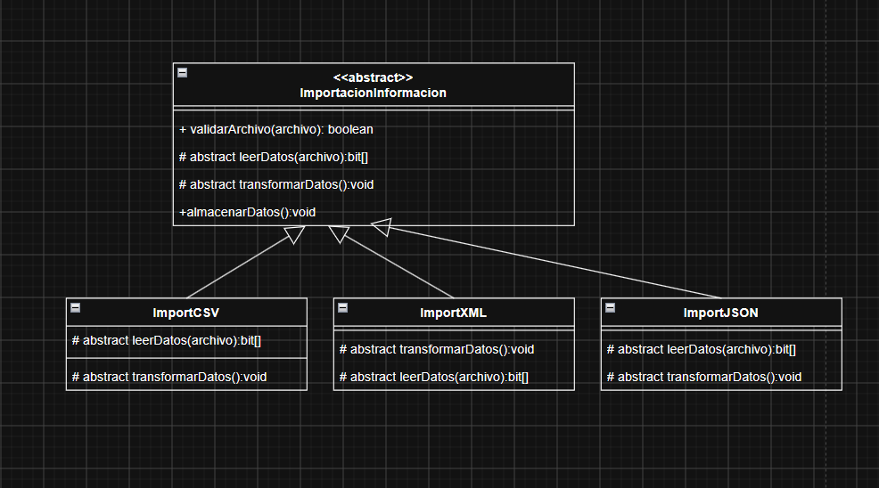

# Unidad 03.01 · Caso 4: importación de archivos

**El patrón es Template Method.** La clase base fija el orden validar → leer → transformar → almacenar; CSV, JSON y XML especializan la lectura y transformación. Es un patrón de comportamiento: «Estructura» es el título del diagrama de participantes, no significa que el caso pertenezca a los patrones estructurales.

Fuente principal: [Unidad_03_01_PDS.pdf](../../ClasesDiapositivas/Unidad_03_01_PDS.pdf), estructura de Template Method en la página 15 y caso 4 en la página 18. Los campos, esquemas y almacenamiento de este ejemplo son elaboración didáctica, ya que el enunciado no los concreta.

Recursos: [UML corregido y explicación](UML-CORREGIDO.md) · [SVG editable](uml-corregido.svg) · [Decisiones](DECISIONES.md) · [Prompt reutilizable](PROMPT-FINAL.md).

## El cambio principal de tu UML

La herencia de tu dibujo es adecuada. Lo que faltaba era una operación que utilizara los pasos en un orden fijo. Tener varios métodos relacionados en una clase abstracta no basta para mostrar Template Method: debe existir la plantilla que los coordina.

En [ImportacionInformacion.java](src/ejemplo/template/ImportacionInformacion.java), la parte central es:

```java
T datos = leerDatos(archivo);
List<Registro> registros = List.copyOf(transformarDatos(datos));
almacenarDatos(registros);
return registros;
```

Esas líneas están dentro de `public final List<Registro> importar(Path archivo)`, después de validar el archivo y comprobar que no coincide con el destino. `final` impide sobrescribir la secuencia. Las subclases no implementan `importar`: heredan el flujo y aportan los dos pasos abstractos. El cliente solo llama a la plantilla.

## Participantes y datos

| Clase | Papel y responsabilidad |
|---|---|
| [ImportacionInformacion](src/ejemplo/template/ImportacionInformacion.java) | AbstractClass; implementa plantilla, validación básica y almacenamiento común. |
| [ImportCSV](src/ejemplo/template/ImportCSV.java) | ConcreteClass; lee filas CSV y transforma sus columnas en registros. |
| [ImportJSON](src/ejemplo/template/ImportJSON.java) | ConcreteClass; lee un arreglo de objetos JSON y convierte sus campos. |
| [ImportXML](src/ejemplo/template/ImportXML.java) | ConcreteClass; lee un documento XML y extrae los registros de su árbol. |
| [Registro](src/ejemplo/template/Registro.java) | Resultado común inmutable con código y nombre obligatorios. |
| [Main](src/ejemplo/template/Main.java) | Cliente de demostración; elige el formato y llama a `importar`. |
| [Csv](src/ejemplo/template/Csv.java) | Auxiliar de lectura/escritura del dialecto CSV del ejemplo. No es otro participante del patrón. |

`T` representa el tipo leído por la variante: filas para CSV, objetos con campos para JSON y un `Document` para XML. Esto deja explícito el paso de información entre lectura y transformación. `bit[]` no existe en Java; `byte[]` sí existe, pero representa bytes y no es la estructura elegida en este ejemplo.

Los pasos son `protected` (`#` en UML). Lectura y transformación son abstractas únicamente en la base. En las clases concretas se implementan con `@Override` y dejan de ser abstractas. La validación y el almacenamiento son comunes y `final` para mantener esas responsabilidades en la base.

El selector de `Main` no convierte el ejercicio en Factory Method o Strategy. Solo configura la demostración; el algoritmo sigue controlado por herencia en la plantilla.

## Archivos de ejemplo y transformación

Los tres archivos describen los mismos dos registros, pero con estructuras diferentes:

| Entrada | Estructura | Transformación |
|---|---|---|
| [registros.csv](datos/registros.csv) | Cabecera `codigo,nombre` y filas de dos columnas. | Columna 1 → código; columna 2 → nombre. |
| [registros.json](datos/registros.json) | Arreglo de objetos con `id` y `nombreCompleto`, ambos texto. | `id` → código; `nombreCompleto` → nombre. |
| [registros.xml](datos/registros.xml) | Raíz `registros`, hijos `registro` con atributo `codigo` y un elemento `nombre`. | Atributo → código; texto del elemento → nombre. |

La transformación elimina espacios exteriores y exige campos no vacíos. No altera las comas, comillas ni saltos internos de los nombres. Se obtienen `P001 / Teclado` y `P002 / Monitor, 24 pulgadas`. Almacenarlos genera el mismo CSV normalizado en los tres casos:

```csv
codigo,nombre
"P001","Teclado"
"P002","Monitor, 24 pulgadas"
```

La validación inicial revisa que la entrada sea un archivo regular, legible y no vacío. La sintaxis se comprueba al leer; los campos requeridos se comprueban al transformar. Una colección válida vacía (`[]`, `<registros/>` o CSV con solo cabecera) es aceptada y genera únicamente la cabecera de salida.

## Ejecutar

Requisito: JDK 11 o superior con `java` y `javac` en el PATH. Se verificó usando OpenJDK 21.0.2 y compilación `--release 11 -encoding UTF-8 -Xlint:all`.

Desde la raíz de MSNOTES:

```powershell
& '.\PATRONES DE DISEÑO DE SOFTWARE\Ejercicios\TemplateMethod-Caso04-Importacion\verificar.ps1'
```

Desde la carpeta del ejercicio, basta `./verificar.ps1`. El [script](verificar.ps1) prepara la biblioteca JSON, compila en una carpeta nueva, ejecuta la demostración de los tres formatos y corre las pruebas. Cada ejecución de demostración crea una carpeta `out/resultados/ejecucion-...`, por lo que se puede repetir sin sobrescribir resultados anteriores.

La lectura JSON usa **Jackson Core 2.21.4**, licencia Apache 2.0. El script reutiliza el JAR si ya está en `lib/` o en la caché Maven local; de lo contrario lo descarga desde Maven Central. No necesita instalar Maven. La primera ejecución requiere internet solo si no existe esa copia. Siempre verifica su SHA-256:

```text
4b40a06396f239f8de2da57419adde6e94e5edc18a2171d471ea05eeed4e5c2d
```

CSV y XML no requieren otras bibliotecas. `out/` y `lib/` están ignorados por Git. La verificación realizada reutilizó el JAR local y comprobó su hash; también se comprobó que la URL de descarga responde.

Para importar un archivo concreto, después de ejecutar el script y desde esta carpeta:

```powershell
$classPathImportacion = (Get-Content -LiteralPath '.\out\classpath.txt' -Raw).Trim()
java '-Dfile.encoding=UTF-8' '-Dstdout.encoding=UTF-8' '-Dstderr.encoding=UTF-8' -cp $classPathImportacion ejemplo.template.Main json '.\datos\registros.json' '.\out\mi-importacion.csv'
```

El destino debe ser nuevo. Cambia su nombre para repetir esa orden. `csv`, `json` y `xml` son los formatos admitidos; no se adivina el formato por la extensión.

## Pruebas y alcance comprobado

**Resultado: 17/17 pruebas aprobadas**, sin advertencias del compilador. Las [pruebas](test/ejemplo/template/ImportacionTest.java) verifican:

- Equivalencia de salida de los tres formatos y resultado no modificable.
- Colecciones vacías válidas, CSV con comas/comillas/saltos y BOM, escapes JSON y entidades XML normales.
- Rechazo de archivos inválidos, esquemas incorrectos, campos vacíos, JSON duplicado y XML con entidades externas.
- Validación antes de leer, lectura antes de transformar y almacenamiento después de transformar.
- Interrupción del flujo ante errores, métodos comunes `final`, conservación de entrada/destino y propagación de fallos al guardar.

El ejemplo procesa archivos pequeños completos en memoria. No es un importador universal: espera los esquemas descritos, CSV con separador coma y codificación UTF-8 para CSV/JSON; XML utiliza su declaración de codificación. No incorpora base de datos, deduplicación global, transacciones ni procesamiento masivo. Un fallo durante la escritura puede dejar un archivo parcial; no se promete reversión transaccional. Un error anterior al almacenamiento no crea una salida nueva.

## Comparación y material original



Se conservan también la [captura del caso](caso-original.png) y la [captura de la estructura](estructura-original.png). Ninguna se modificó. El diagrama nuevo es una corrección del asistente solicitada por el usuario, no una segunda versión atribuida al grupo.

| Punto | UML original | UML corregido y código |
|---|---|---|
| Jerarquía | Base abstracta y tres subclases. | Se conserva. |
| Plantilla | No aparece. | `importar(archivo)` pública y final. |
| Pasos variables | También abstractos en subclases. | Abstractos en la base, concretos en las variantes. |
| Flujo de datos | `bit[]` y transformación sin parámetros ni resultado. | Datos leídos `T` → `List<Registro>` → almacenamiento. |
| Uso del cliente | Podría invocar validación/almacenamiento por separado. | Entra por la plantilla; los pasos son protegidos. |

## Correcciones y mejoras de tu UML

1. **Añadir `+ importar(archivo: Path): List<Registro> {leaf}`** en la base. Es la operación central que faltaba para mostrar Template Method; en Java se declara `final`.
2. **Quitar `abstract` de los métodos en `ImportCSV`, `ImportJSON` e `ImportXML`.** Las tres son clases concretas y deben implementar esos pasos.
3. **Sustituir `bit[]` y completar el paso de datos.** El modelo usa `leerDatos(archivo): T` y `transformarDatos(datos: T): List<Registro>`; así el resultado de cada etapa alimenta la siguiente.
4. **Mantener validación y almacenamiento comunes, con visibilidad protegida.** La lectura y transformación también son protegidas; el cliente solo necesita la operación pública de importación.
5. **Conservar las flechas de generalización apuntando a la base**, como ya hiciste. No hace falta cambiar la jerarquía ni escoger otro patrón.
