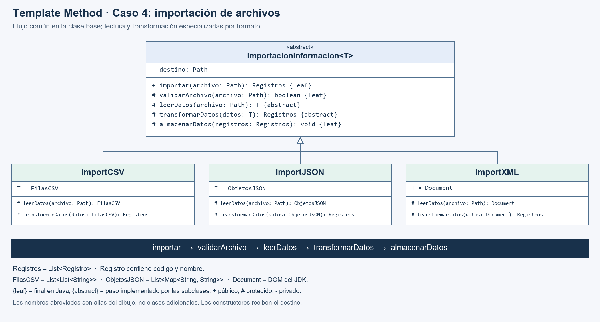
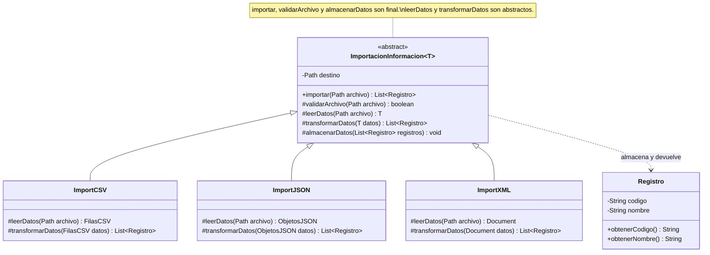

# UML corregido · Template Method, importación de archivos



Versión vectorial: [SVG](uml-corregido.svg). Se conservan las cuatro clases principales del dibujo original; `Registro` es el modelo común de salida utilizado por el ejemplo Java.

## Versión editable en Mermaid



`T` es un parámetro de tipo Java: permite que el resultado de lectura sea distinto en cada subclase sin recurrir a `Object` ni conversiones de tipo inseguras. Los nombres cortos del dibujo son alias explicativos, no clases adicionales:

| Subclase | Especialización de `T` | Alias en el dibujo |
|---|---|---|
| `ImportCSV` | `List<List<String>>` | `FilasCSV` |
| `ImportJSON` | `List<Map<String, String>>` | `ObjetosJSON` |
| `ImportXML` | `org.w3c.dom.Document` | `Document` |

`Registros` en la imagen equivale a `List<Registro>`. Se omiten constructores y auxiliares de lectura del diagrama principal para concentrarlo en el patrón; todos los importadores reciben un destino `Path` en su constructor.

En la imagen, `{leaf}` significa que esa operación no puede redefinirse; en Java se implementa con `final`. `{abstract}` indica que la clase base declara el paso, pero la subclase debe implementarlo. Las implementaciones concretas no llevan `abstract`. `+` significa público y `#`, protegido.

## Secuencia que controla la base

```text
Cliente llama importar(archivo)
  1. validarArchivo(archivo)
  2. datos = leerDatos(archivo)
  3. registros = transformarDatos(datos)
  4. almacenarDatos(registros)
  5. devolver registros
```

La validación inicial revisa existencia, tipo, lectura y tamaño; la sintaxis se comprueba al leer y el esquema de los registros al transformar. Si falla un paso, se propaga el error y no se invocan los pasos posteriores. El flujo principal no se repite en las subclases.

## Comparación con tu dibujo

| Original | Corrección | Razón |
|---|---|---|
| Base abstracta y tres subclases | Se conservan. | La estructura de herencia corresponde a Template Method. |
| Falta la operación que organiza los pasos | Se añade `importar(archivo)` como pública y `final`. | Es la plantilla que mantiene fijo el algoritmo. |
| Leer/transformar abstractos también en clases concretas | Solo son abstractos en la base. | Las variantes concretas deben poder instanciarse y ejecutar sus pasos. |
| `leerDatos` devuelve `bit[]` | Se usa el tipo `T` leído por cada variante. | Java no tiene `bit[]`; `byte[]` sería válido para bytes, pero el ejemplo trabaja con estructuras ya analizadas. |
| `transformarDatos(): void` no recibe datos | Recibe `T` y devuelve una lista de registros. | Hace visible cómo viaja la información entre pasos. |
| Validación y almacenamiento públicos | Se dejan protegidos y comunes. | El cliente entra por la plantilla y no ejecuta etapas aisladas. |
